# C1 — Contexto do Sistema

> C4 Model · Nível 1 · Visão macro do ecossistema 5impl.is

---

## Diagrama

```mermaid
C4Context
  title 5impl.is — Contexto Completo

  Person(socio, "Sócio / Fundador", "Aprova conteúdo, contratos e decisões críticas via HITL no Paperclip")
  Person(lead, "Lead", "Potencial cliente capturado via site, WhatsApp ou redes sociais")
  Person(cliente_consulting, "Cliente de Consultoria", "Empresa ou Igreja que contratou projeto de automação")
  Person(lider_igreja, "Líder de Igreja", "Administrador da instância Church Platform do sua igreja")

  System_Boundary(fiveimpl_boundary, "5impl.is") {
    System(fiveimpl, "Sistema de Automação 5impl", "Orquestração de 41 agentes de IA em Paperclip integrados a Directus, n8n, LiteLLM e Hermes")
  }

  System_Ext(whatsapp, "WhatsApp Business", "Canal primário de comunicação receptiva e ativa com leads, clientes e líderes de igrejas")
  System_Ext(zernio, "Zernio", "Captura leads via formulários e webhooks; publica posts nas redes sociais conectadas")
  System_Ext(gateway_fin, "Gateway Financeiro", "Processa pagamentos recorrentes (Church SaaS) e avulsos (créditos de IA, milestones)")
  System_Ext(clicksign, "Clicksign / ZapSign", "Plataforma de assinatura digital para contratos de consultoria")
  System_Ext(cloudflare, "Cloudflare Pages", "Hospedagem e CI/CD do site estático Astro (5impl.is)")
  System_Ext(coolify, "Coolify / Docker", "Orquestrador de containers para provisionar instâncias Church Platform por cliente")
  System_Ext(llm, "Anthropic / OpenAI", "Modelos de linguagem (Claude, GPT-4) acessados via proxy LiteLLM")
  System_Ext(canva, "Canva API", "Geração de assets visuais a partir de templates brandados")
  System_Ext(telegram, "Telegram", "Canal de alertas P1 e relatórios executivos para os sócios")
  System_Ext(gsearch, "Google Search Console", "Métricas de tráfego orgânico e palavras-chave para o ContentAnalyst")
  System_Ext(clicksign2, "Puppeteer Service", "Serviço HTTP local para renderização de PDFs (contratos, invoices)")

  Rel(socio, fiveimpl, "HITL: aprovação de conteúdo, contratos e provisioning")
  Rel(lead, fiveimpl, "Entra via site (waitlist), WhatsApp ou formulário Zernio")
  Rel(cliente_consulting, fiveimpl, "Assina contrato, recebe workspace, acompanha milestones")
  Rel(lider_igreja, fiveimpl, "Assina plano, usa Church Platform, solicita suporte via WhatsApp")

  Rel(fiveimpl, whatsapp, "Qualificação, suporte RAG, notificações e onboarding")
  Rel(fiveimpl, zernio, "Publica posts agendados; recebe webhooks de leads")
  Rel(fiveimpl, gateway_fin, "Cria e gerencia assinaturas, processa cobranças, recebe webhooks de pagamento")
  Rel(fiveimpl, clicksign, "Faz upload de PDF, configura partes, obtém link de assinatura")
  Rel(fiveimpl, cloudflare, "Dispara webhook de build após publicação de post")
  Rel(fiveimpl, coolify, "Envia comando de provisioning de nova instância Docker")
  Rel(fiveimpl, llm, "Todas as chamadas LLM passam pelo proxy LiteLLM com Virtual Keys")
  Rel(fiveimpl, canva, "Gera assets via n8n → Canva API com variáveis de conteúdo")
  Rel(fiveimpl, telegram, "Alertas P1 e relatórios mensais executivos")
  Rel(fiveimpl, gsearch, "Coleta métricas SEO semanalmente via ContentAnalyst")
```

---

## Atores

### Internos (Humanos)

| Ator | Papel | Pontos de Interação |
|---|---|---|
| **Sócio / Fundador** (`@itbrda`) | Curador e aprovador final | Paperclip UI (HITL issues), WhatsApp, Telegram |

### Externos (Humanos)

| Ator | Papel | Canal de Entrada |
|---|---|---|
| **Lead** | Potencial cliente ainda não qualificado | Site (waitlist form), WhatsApp, Zernio form |
| **Cliente de Consultoria** | Empresa contratante de projetos de automação | WhatsApp (SalesQualifier), Email (Hermes), Paperclip workspace próprio |
| **Líder de Igreja** | Administrador da Church Platform SaaS | WhatsApp (onboarding + suporte), Email (Hermes), Church Platform UI |

---

## Fronteiras do Sistema

### O que está DENTRO do sistema 5impl.is
- Todos os 41 agentes Paperclip e seus workflows
- CRM interno (Directus 5impl)
- Pipeline editorial e publicação
- Funil de vendas e geração de propostas/contratos
- Gestão de assinaturas Church SaaS
- Governança de tokens LiteLLM
- Provisionamento de workspaces de clientes

### O que está FORA (sistemas externos integrados)
- Os sistemas dos clientes (construídos dentro dos workspaces deles)
- Plataformas de redes sociais (acessadas via Zernio)
- Gateway de pagamento (processamento financeiro)
- Plataformas de assinatura (Clicksign)
- Infraestrutura de hosting Church (Coolify)
- APIs de LLM (Anthropic/OpenAI)
