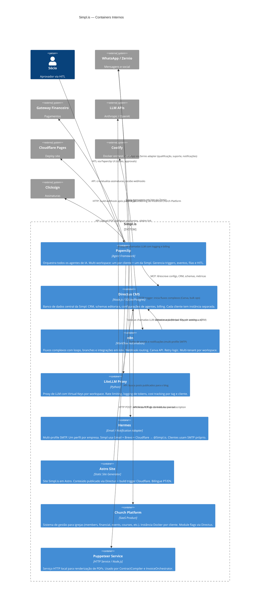

# C2 — Containers

> C4 Model · Nível 2 · Componentes técnicos internos e comunicação

---

## Diagrama

---

## Descrição dos Containers

### Paperclip
- **Função:** Orquestrador central de todos os agentes de IA
- **Multi-workspace:** Cada cliente tem workspace isolado; 5impl tem o seu próprio
- **Mecanismo:** Eventos assíncronos, cron jobs, webhooks inbound, HITL via issues
- **Tools/MCPs disponíveis:** Directus MCP, Hermes adapter, HTTP tool, Paperclip admin tool, RAG tool

### Directus CMS
- **Função (5impl workspace):** CRM, configurações de agentes, schemas editoriais, dados financeiros
- **Função (workspace cliente):** Backend/API do produto entregue ao cliente
- **Função (Church Platform):** Feature flags de módulos por assinatura
- **Multi-tenant:** Instância separada por cliente; 5impl tem a sua própria

### n8n
- **Função:** Fluxos de automação com lógica complexa que não justifica um agente
- **Casos de uso:** Webhook routing com múltiplos branches, Canva API (template filling), atualização de `last_activity` da Church Platform no CRM, bulk newsletter com rate limiting, retry de pagamento no gateway
- **Multi-tenant:** Workspace separado por cliente de consultoria

### LiteLLM Proxy
- **Função:** Centralizar todas as chamadas LLM com controle de custo, rate limiting e logging
- **Virtual Keys:** Uma por workspace Paperclip (clientes + 5impl interna)
- **Tags:** Cada agente injeta `X-LiteLLM-Tag` com seu specialty para granularidade de custos
- **Logging:** Persiste usage em `Token_Usage` no Directus via QuotaAuditor

### Hermes
- **Função:** Adapter de email/notificação plugado no Paperclip
- **Multi-profile:** Um perfil SMTP por empresa
- **5impl profile:** Gmail + Brevo + Cloudflare → domínio `@5impl.is`
- **Cliente profile:** SMTP configurado com credenciais do cliente (coletadas no WorkspaceProvisioner HITL)
- **Capacidades:** Email transacional, newsletter em lote, templates com variáveis

### Astro Site
- **Função:** Site público 5impl.is (marketing, blog, landing pages)
- **Conteúdo:** Posts vêm do Directus; publicação via `StaticSitePublisher` + build Cloudflare
- **I18n:** PT e EN

### Church Platform
- **Função:** Produto SaaS para igrejas — gestão completa
- **Módulos:** Membros, Financeiro, Pastoral, Eventos, Campanhas, Doações, Cursos, Sermões, Patrimônio, Escalas, Multi-Igreja, App do Contribuinte, App do Líder, Gestão de Projetos, Formulários
- **Media App:** Módulo/addon — ativado por flag no Directus (`module_media_app`)
- **Feature flags:** Church Platform API consulta `Church_Subscriptions` no Directus 5impl para liberar/bloquear módulos

### Puppeteer Service
- **Função:** Renderizar PDFs a partir de templates HTML/Markdown
- **Uso:** `ContractCompiler` (contratos), `InvoiceOrchestrator` (cobranças de milestone)
- **Pattern:** HTTP service sem inteligência → não é um agente

---

## Padrão de Comunicação entre Containers

| De | Para | Mecanismo | Quando |
|---|---|---|---|
| Paperclip Agent | Directus | MCP (SDK) | Sempre que precisa ler/escrever dados com contexto inteligente |
| Paperclip Agent | n8n | HTTP POST (trigger) | Fluxos complexos: Canva, bulk ops, retry logic |
| Paperclip Agent | LiteLLM | HTTP (SDK) | Toda chamada de LLM |
| Paperclip Agent | Hermes | Adapter tool | Envio de email ou notificação |
| Paperclip Agent | Puppeteer | HTTP POST | Geração de PDF |
| n8n | Directus | REST API / SDK | Sincronização de dados (ex: Church activity) |
| n8n | Zernio/WhatsApp | HTTP | Mensagens em lote |
| External Webhook | n8n / Paperclip | HTTPS POST | Eventos externos (gateway, Zernio, Church Platform) |
