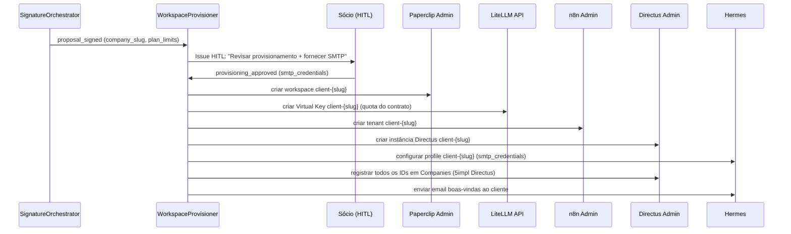
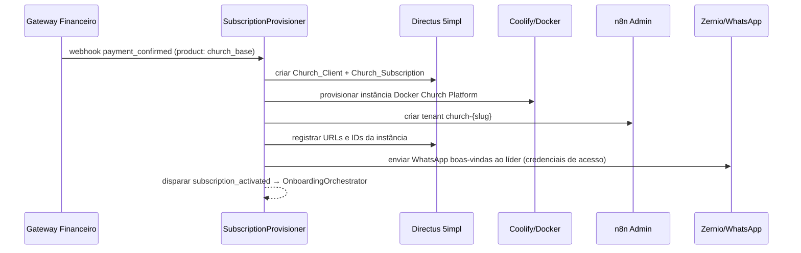

# Arquitetura Multi-Tenant

> Isolamento de workspaces, fronteiras de dados e responsabilidades por tenant

---

## Topologia de Workspaces

```
┌─────────────────────────────────────────────────────────────────────────┐
│                      INFRAESTRUTURA COMPARTILHADA                       │
│  Paperclip (multi-workspace) · LiteLLM (multi-vkey) · n8n (multi-ws)   │
│  Hermes (multi-profile) · Directus (multi-instance)                     │
└───────────────────────────┬─────────────────────────────────────────────┘
                            │ mesma infra — tenants completamente isolados
         ┌──────────────────┼──────────────────────────┐
         ▼                  ▼                           ▼
┌─────────────────┐  ┌─────────────────┐     ┌──────────────────────┐
│  Workspace      │  │  Workspace      │     │  Workspace           │
│  5impl.is       │  │  Cliente A      │     │  Igreja B (SaaS)     │
│                 │  │  (Consultoria)  │     │  (Church Platform)   │
│ CEO Agent       │  │                 │     │                      │
│ Editorial Dept  │  │ Agentes do      │     │ Church Platform      │
│ Sales Dept      │  │ produto do      │     │ + Media App module   │
│ Support Dept    │  │ cliente (n8n,   │     │                      │
│ Financial Dept  │  │ automações)     │     │ Instância Directus   │
│                 │  │                 │     │ (dados da igreja)    │
│ Directus 5impl  │  │ Directus        │     │                      │
│ (CRM + Config)  │  │ (produto deles) │     │ Hermes profile       │
│                 │  │                 │     │ (SMTP da igreja)     │
│ LiteLLM VKey    │  │ LiteLLM VKey    │     │                      │
│ 5impl-internal  │  │ client-a        │     │ LiteLLM VKey         │
│                 │  │                 │     │ church-b             │
│ Hermes profile  │  │ Hermes profile  │     │                      │
│ @5impl.is       │  │ @cliente-a.com  │     │ n8n tenant           │
│                 │  │                 │     │ church-b             │
│ n8n tenant      │  │ n8n tenant      │     │                      │
│ 5impl           │  │ client-a        │     └──────────────────────┘
└─────────────────┘  └─────────────────┘
        ▲
        │
  TODOS os contratos,
  cobranças, CRM e
  operação da 5impl
  ficam AQUI
```

---

## Fronteiras por Componente

### Paperclip

| Workspace | O que roda | Criado por |
|---|---|---|
| `5impl` | Todos os 41 agentes operacionais da 5impl | Manual (setup inicial) |
| `client-{slug}` | Agentes e automações do produto entregue ao cliente | `WorkspaceProvisioner` (pós-contrato) |
| `church-{slug}` | Agentes de suporte e automações da Church Platform | `SubscriptionProvisioner` (pós-pagamento) |

**Regra:** Issues de contrato, cobrança e CRM de TODOS os clientes ficam sempre no workspace `5impl`. O workspace do cliente é exclusivo para os entregáveis dele.

---

### Directus

| Instância | Dados armazenados | Multi-tenant |
|---|---|---|
| `directus.5impl.is` | CRM, Editorial_Plan, Proposals, Church_Subscriptions, Gatekeepers, Token_Usage | Único — todos os dados operacionais da 5impl |
| `directus.client-a.com` | Dados do produto do cliente A (o que 5impl construiu para eles) | Uma instância por cliente de consultoria |
| `directus.church-b.app` | Dados da Church Platform da Igreja B | Uma instância por assinante Church SaaS |

**Importante:** `Church_Subscriptions` e `Church_Clients` vivem no Directus 5impl, não na instância da igreja. Isso protege os dados de billing e permite que a Church Platform API consulte feature flags sem acessar o CRM interno.

---

### LiteLLM

| Virtual Key | Workspace | Limite | Quem monitora |
|---|---|---|---|
| `5impl-internal` | 5impl (agentes operacionais) | Definido em Company_Settings | `QuotaAuditor` (bucket interno) |
| `client-{slug}` | Workspace do cliente | Definido no contrato (Proposals) | `QuotaAuditor` + `BillingGatekeeper` |
| `church-{slug}` | Workspace da Igreja | Definido no plano (Church_Subscriptions) | `QuotaAuditor` + `BillingGatekeeper` |

**Tag obrigatória:** Cada agente injeta `X-LiteLLM-Tag: {department}.{agent_id}` em toda chamada (ex: `editorial.content_writer`). Permite rastrear custo por agente.

---

### n8n

| Tenant | Workflows | Criado por |
|---|---|---|
| `5impl` | Webhook routing, Canva API, Church activity sync, bulk ops internas | Manual |
| `client-{slug}` | Automações entregues ao cliente (produto da consultoria) | `WorkspaceProvisioner` |
| `church-{slug}` | Automações operacionais da Igreja (ex: sync de membros) | `SubscriptionProvisioner` |

---

### Hermes (Email)

| Profile | SMTP | Remetente | Criado por |
|---|---|---|---|
| `5impl` | Gmail + Brevo + Cloudflare | `*@5impl.is` | Manual |
| `client-{slug}` | SMTP do cliente (Gmail, SendGrid, etc.) | `*@cliente.com` | `WorkspaceProvisioner` (pós HITL com credenciais) |
| `church-{slug}` | SMTP da igreja (opcional) ou 5impl como remetente | Configura no onboarding | `OnboardingOrchestrator` |

---

## Fluxo de Criação de Tenant (Consultoria)



---

## Fluxo de Criação de Tenant (Church SaaS)



---

## Isolamento de Dados — Regras

| Dado | Onde fica | Quem acessa |
|---|---|---|
| Dados do CRM (leads, deals) | Directus 5impl | Agentes Sales + CEO |
| Contratos e propostas | Directus 5impl | Agentes Sales + Financial |
| Dados de billing (subscriptions, addendums) | Directus 5impl | Agentes Financial + SaaS Church |
| Feature flags da Church Platform | Directus 5impl (`Church_Subscriptions`) | Church Platform API (leitura) |
| Dados da Igreja (membros, finanças, eventos) | Directus instância da igreja | Church Platform App |
| Dados do produto do cliente B2B | Directus instância do cliente | Workspace do cliente |
| Token usage | Directus 5impl (`Token_Usage`) | QuotaAuditor, FinancialReporter |
| Configurações de agentes | Directus 5impl (Gatekeepers, Dunning_Rules, etc.) | Agentes correspondentes |
