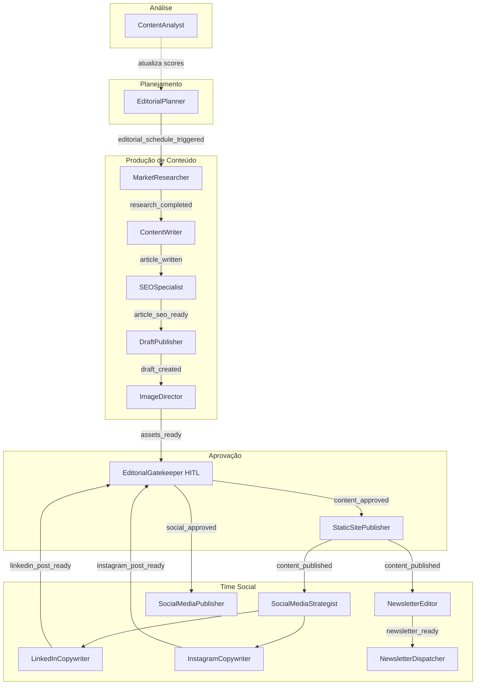

# Departamento Editorial & Marketing

> 15 agentes especializados organizados em 3 times: **Produção de Conteúdo**, **Time Social** e **Análise**

---

## Diagrama do Time Editorial



---

## EditorialPlanner (`editorial_planner`)

| Campo | Valor |
|---|---|
| **agent_id** | `editorial_planner` |
| **Trigger** | Cron dia 1 de cada mês às 07:00 |
| **Tools/MCPs** | `web_search`, `directus_mcp`, `paperclip_issues_tool` |

**Responsabilidade:** Planejar o calendário editorial mensal com base nas configurações de pilares, performance histórica e tendências de mercado.

**Fluxo:**
1. Lê `Editorial_Pillars` no Directus (pilares ativos, pesos, min_posts_per_month)
2. Lê `Content_Performance` para identificar tópicos com alta tração
3. Pesquisa trends na web para cada pilar (últimas 4 semanas)
4. Gera 4–6 sugestões de pauta por pilar com `title`, `target_keywords`, `content_brief`
5. Cria issues no Paperclip para aprovação do Sócio
6. Após aprovação: popula `Editorial_Plan` no Directus com as pautas do mês

**Parâmetros no Directus:**
- `Editorial_Pillars.min_posts_per_month` — mínimo de posts por pilar
- `Editorial_Pillars.priority_weight` — peso na distribuição do calendário
- `Editorial_Pillars.trend_keywords` — termos-semente para pesquisa de tendências

---

## MarketResearcher (`market_researcher`)

| Campo | Valor |
|---|---|
| **agent_id** | `market_researcher` |
| **Trigger** | `editorial_schedule_triggered` (disparado por n8n ao processar Editorial_Plan) |
| **Tools/MCPs** | `web_search` |

**Responsabilidade:** Realizar pesquisa profunda e estruturada sobre o tópico da pauta. Retorna um `research_brief` que serve de base para o `ContentWriter`.

**Fluxo:**
1. Recebe: `{ title, target_keywords, content_brief, pillar }`
2. Executa múltiplas buscas: panorama do tema, dados/estatísticas recentes, perspectivas de especialistas, exemplos práticos
3. Retorna `research_brief`: seções temáticas, fontes, dados quantitativos, ângulos sugeridos

**Output:** `research_completed` event com payload `research_brief` estruturado

---

## ContentWriter (`content_writer`)

| Campo | Valor |
|---|---|
| **agent_id** | `content_writer` |
| **Trigger** | `research_completed` |
| **Tools/MCPs** | nenhum (puro LLM) |

**Responsabilidade:** Escrever o artigo completo em Markdown a partir do `research_brief` e das diretrizes editoriais da 5impl.

**Fluxo:**
1. Recebe `research_brief` + metadados do pilar (tom, audiência, profundidade)
2. Escreve artigo completo: headline, introdução, seções com H2/H3, exemplos práticos, conclusão com CTA
3. Aplica diretrizes editoriais: tom direto e confiante (PT), professional e concise (EN)
4. Inclui sugestões de links internos (marcados como `[[INTERNAL_LINK: tópico]]` para o SEOSpecialist)

**Output:** `article_written` com body em Markdown

---

## SEOSpecialist (`seo_specialist`)

| Campo | Valor |
|---|---|
| **agent_id** | `seo_specialist` |
| **Trigger** | `article_written` |
| **Tools/MCPs** | `directus_mcp` (consulta `Content_Performance` para histórico de keywords) |

**Responsabilidade:** Otimizar todos os metadados SEO do artigo.

**Fluxo:**
1. Analisa o artigo e identifica a `focus_keyword` principal
2. Consulta `Content_Performance` para verificar se a keyword já foi trabalhada
3. Gera: `meta_title` (≤60 chars), `meta_description` (≤155 chars), `slug` (URL-friendly)
4. Resolve os `[[INTERNAL_LINK]]` marcados pelo ContentWriter buscando posts relacionados no Directus
5. Calcula `estimated_read_time` = ceil(word_count / 200)

**Output:** `article_seo_ready` com artigo + todos os metadados preenchidos

---

## DraftPublisher (`draft_publisher`)

| Campo | Valor |
|---|---|
| **agent_id** | `draft_publisher` |
| **Trigger** | `article_seo_ready` |
| **Tools/MCPs** | `directus_mcp` |

**Responsabilidade:** Salvar o artigo no Directus com todos os campos do schema `Posts` preenchidos inteligentemente.

**Fluxo:**
1. Recebe artigo completo + metadados SEO + pillar_id
2. Mapeia todos os campos do schema `Posts` com inteligência contextual:
   - Deriva `pillar_id` do pilar informado
   - Formata `estimated_read_time` como Integer
   - Define `status = 'draft'`
   - Garante que `slug` é único (sufixo numérico se já existe)
3. Cria o registro via `directus_mcp`

**Output:** `draft_created` com `{ post_id, title, slug }`

---

## ImageDirector (`image_director`)

| Campo | Valor |
|---|---|
| **agent_id** | `image_director` |
| **Trigger** | `draft_created` **ou** `social_assets_needed` |
| **Tools/MCPs** | `directus_mcp`, `litellm_api_tool` (DALL-E/Ideogram), `http_tool` (n8n trigger para Canva) |

**Responsabilidade:** Decidir a estratégia de asset visual para cada conteúdo/canal e dirigir a criação.

**Fluxo:**
```
1. Lê Content_Channels.asset_strategy para o canal solicitado

Se asset_strategy = 'ai_generated':
  2a. Cria prompt detalhado de imagem baseado no tema do artigo
      (estilo lido de Content_Channels.ai_image_style)
  3a. Chama LiteLLM → modelo configurado (DALL-E 3 ou Ideogram)
  4a. Recebe URL da imagem gerada

Se asset_strategy = 'canva_template':
  2b. Prepara variáveis do template (título, subtítulo, cores do pilar)
  3b. Dispara n8n flow via HTTP trigger → n8n → Canva API
  4b. Recebe URL do asset renderizado

5. Atualiza post no Directus com cover_image_url
```

**Parâmetros no Directus (`Content_Channels`):**
- `asset_strategy`: estratégia por canal
- `ai_image_style`: ex. `"minimalist dark background, tech aesthetic, no text"`
- `ai_image_model`: `dall-e-3` | `ideogram` | `flux`
- `canva_template_id`: ID do template no Canva

---

## EditorialGatekeeper (`editorial_gatekeeper`)

| Campo | Valor |
|---|---|
| **agent_id** | `editorial_gatekeeper` |
| **Trigger** | `draft_created` **ou** `social_post_drafted` |
| **Tools/MCPs** | `paperclip_issues_tool`, `hermes_tool` (WhatsApp notification) |
| **HITL** | ✅ Sim — bloqueia até aprovação humana |

**Responsabilidade:** Ser o portão de qualidade e aprovação antes de qualquer publicação.

**Fluxo:**
```
Recebe notificação de conteúdo pronto
  │
  ▼
Cria issue no Paperclip com:
  - Preview link do post (Directus ou payload do social)
  - Botões rápidos: [Aprovar] [Recusar] [Solicitar revisão]
  │
  ▼
Envia WhatsApp ao Sócio: "Novo conteúdo aguarda aprovação"
  │
  ▼ PAUSA até decisão humana
  │
  ├── approved → dispara content_approved / social_approved
  └── declined → notifica agente anterior para revisão
```

---

## StaticSitePublisher (`static_site_publisher`)

| Campo | Valor |
|---|---|
| **agent_id** | `static_site_publisher` |
| **Trigger** | `content_approved` |
| **Tools/MCPs** | `directus_mcp`, `http_tool` (Cloudflare build webhook) |

**Responsabilidade:** Publicar o post aprovado e disparar o rebuild do site estático.

**Fluxo:**
1. Atualiza `Posts.status = 'published'` e `Posts.published_at = now()` via `directus_mcp`
2. Faz POST no Cloudflare Pages build webhook (URL em `Company_Settings.cloudflare_build_webhook`)
3. Aguarda confirmação de build (polling ou webhook de retorno)
4. Notifica Sócio via Hermes: "Post '{title}' publicado em 5impl.is/blog/{slug}"

**Output:** `content_published` com `{ post_id, url, published_at }`

---

## SocialMediaStrategist (`social_media_strategist`)

| Campo | Valor |
|---|---|
| **agent_id** | `social_media_strategist` |
| **Trigger** | `content_published` **ou** nova issue com tag `social_campaign` |
| **Tools/MCPs** | `directus_mcp` (Social_Editorial_Rules, Content_Channels) |

**Responsabilidade:** Orquestrar o time social — decidir quais plataformas, ângulos e formatos para cada peça de conteúdo.

**Fluxo (blog-driven):**
1. Lê o artigo publicado via `directus_mcp`
2. Consulta `Social_Editorial_Rules` por plataforma
3. Consulta `Content_Channels` para saber quais plataformas estão ativas
4. Cria briefs específicos por plataforma e delega:
   - LinkedIn ativo → instancia `LinkedInCopywriter` com brief
   - Instagram ativo → instancia `InstagramCopywriter` com brief

**Fluxo (issue-driven):**
1. Lê descrição da issue de campanha
2. Se precisar de dados de produto/contrato → instancia sub-agentes (ex: `ContractCompiler` em modo leitura)
3. Cria briefs e delega ao time social

**Parâmetros:** `Social_Editorial_Rules.tone_guidelines`, `Content_Channels.max_chars`, `Content_Channels.posting_time`

---

## LinkedInCopywriter (`linkedin_copywriter`)

| Campo | Valor |
|---|---|
| **agent_id** | `linkedin_copywriter` |
| **Trigger** | Delegado pelo `social_media_strategist` |
| **Tools/MCPs** | nenhum (puro LLM) |

**Responsabilidade:** Adaptar o conteúdo para o formato LinkedIn.

**Formato de saída:**
- Hook de abertura (primeira linha visível sem "ver mais") — máx. 220 chars
- Corpo com quebras de linha a cada 2–3 frases
- 3–5 emojis pontuais
- CTA final com link do artigo
- Sem hashtags no corpo (opcional no final)
- Limite: 3000 chars

---

## InstagramCopywriter (`instagram_copywriter`)

| Campo | Valor |
|---|---|
| **agent_id** | `instagram_copywriter` |
| **Trigger** | Delegado pelo `social_media_strategist` |
| **Tools/MCPs** | `directus_mcp` (lê hashtag strategy de `Social_Editorial_Rules`) |

**Responsabilidade:** Adaptar o conteúdo para o formato Instagram.

**Formato de saída:**
- Hook forte nas primeiras 125 chars (visível sem expandir)
- Corpo conciso com emojis
- Separador visual (•••)
- Bloco de hashtags (quantidade definida em `Content_Channels.hashtag_count`)
- Se format = carousel: escreve legenda de cada slide separadamente

---

## NewsletterEditor (`newsletter_editor`)

| Campo | Valor |
|---|---|
| **agent_id** | `newsletter_editor` |
| **Trigger** | `content_published` |
| **Tools/MCPs** | nenhum (puro LLM) |

**Responsabilidade:** Adaptar o artigo publicado para o formato de email newsletter.

**Campos gerados:**
- `subject_line`: assunto do email (≤50 chars, com curiosidade/benefício)
- `preheader`: texto de preview (≤90 chars)
- `email_excerpt`: resumo de 3–4 parágrafos do artigo
- `cta_text`: texto do botão de CTA
- `cta_url`: link do artigo publicado

**Output:** `newsletter_ready` com payload completo

---

## NewsletterDispatcher (`newsletter_dispatcher`)

| Campo | Valor |
|---|---|
| **agent_id** | `newsletter_dispatcher` |
| **Trigger** | `newsletter_ready` |
| **Tools/MCPs** | `hermes_tool`, `directus_mcp` |

**Responsabilidade:** Segmentar a lista e disparar o email de newsletter.

**Fluxo:**
1. Lê `newsletter_ready` payload (subject, preheader, excerpt, cta)
2. Consulta Directus: Leads + Waitlist com `status ≠ unsubscribed` e vertical compatível com o pilar do artigo
3. Para cada segmento, renderiza o template com variáveis do destinatário
4. Dispara em lote via `hermes_tool` (profile @5impl.is)

---

## SocialMediaPublisher (`social_media_publisher`)

| Campo | Valor |
|---|---|
| **agent_id** | `social_media_publisher` |
| **Trigger** | `social_approved` (após aprovação do EditorialGatekeeper) |
| **Tools/MCPs** | `zernio_tool` |

**Responsabilidade:** Publicar os posts aprovados via Zernio com o asset visual correto.

**Fluxo:**
1. Recebe lote de posts aprovados (LinkedIn copy, Instagram copy, asset URLs)
2. Formata payload específico por plataforma para a Zernio API
3. Agenda publicação conforme `Content_Channels.posting_time`
4. Confirma agendamento e notifica Sócio

---

## ContentAnalyst (`content_analyst`)

| Campo | Valor |
|---|---|
| **agent_id** | `content_analyst` |
| **Trigger** | Cron toda segunda-feira às 08:00 |
| **Tools/MCPs** | `directus_mcp`, `zernio_tool`, `http_tool` (Google Search Console API) |

**Responsabilidade:** Medir performance de todo o conteúdo publicado e retroalimentar o planejamento editorial.

**Fluxo:**
1. Para cada post publicado na última semana:
   - Busca métricas no Zernio (engajamento por plataforma)
   - Busca métricas no Search Console (impressões, cliques, CTR, posição média)
2. Salva em `Content_Performance` no Directus
3. Calcula `performance_score` = função ponderada de (views, shares, organic_clicks)
4. Atualiza `Editorial_Plan.performance_score` para o post correspondente
5. Identifica os 3 tópicos/pilares com melhor performance → persiste em `Company_Settings.top_performing_pillars`

**Parâmetros:** Pesos de cada métrica configuráveis em `Company_Settings.content_scoring_weights`
