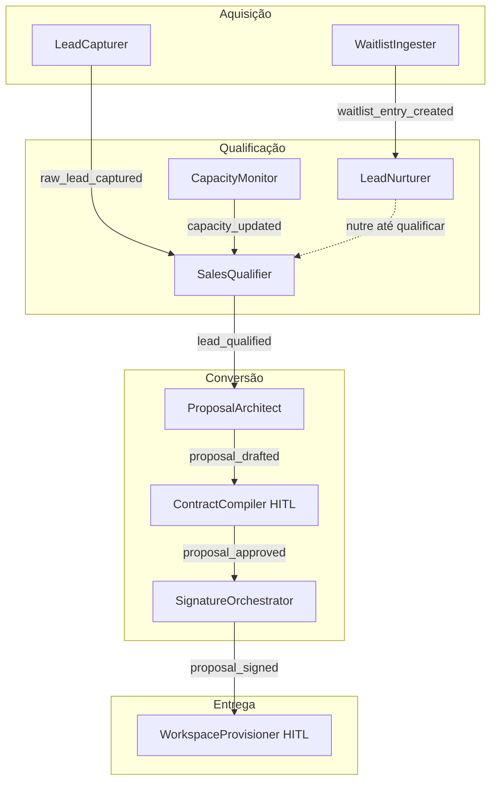

# Departamento Comercial, Vendas e Entrega

> 8 agentes do funil de vendas + 1 agente de provisionamento pós-contrato

---

## Diagrama do Funil



---

## WaitlistIngester (`waitlist_ingester`)

| Campo | Valor |
|---|---|
| **agent_id** | `waitlist_ingester` |
| **Trigger** | Webhook HTTPS POST do formulário de waitlist do site |
| **Tools/MCPs** | `directus_mcp`, `hermes_tool`, `telegram_tool` |

**Responsabilidade:** Processar entradas do formulário de lista de espera do site 5impl.is.

**Fluxo:**
1. Recebe payload: `{ email, name, vertical }`
2. Verifica se email já existe em `Waitlist` ou `Leads` (evita duplicata)
3. Cria registro em `Waitlist` no Directus
4. Dispara email de confirmação via `hermes_tool` (@5impl.is):
   - Subject: "Você está na lista 🎯"
   - Body: confirmação + expectativa de quando terá acesso
5. Se `vertical = 'business'`: notifica Sócio via `telegram_tool` (lead B2B de alto valor)
6. Adiciona lead ao `Lead_Nurture_Progress` na sequência correspondente ao seu vertical

**Output:** `waitlist_entry_created`

---

## LeadNurturer (`lead_nurturer`)

| Campo | Valor |
|---|---|
| **agent_id** | `lead_nurturer` |
| **Trigger** | Cron diário às 08:00 **+** evento `lead_status_changed` |
| **Tools/MCPs** | `directus_mcp`, `hermes_tool`, `zernio_tool` |

**Responsabilidade:** Executar as sequências de nutrição de leads de forma dinâmica, baseado nas regras configuradas no Directus.

**Fluxo:**
```
Cron 08:00:
  1. Busca Lead_Nurture_Progress WHERE status='active' AND next_send_at <= hoje
  2. Para cada registro:
     a. Busca Lead_Nurture_Steps WHERE sequence_id = ? AND step_order = current_step
     b. Renderiza body_template com dados do lead: {name}, {vertical}, {company_name}
     c. Se channel='email' → hermes_tool (email)
        Se channel='whatsapp' → zernio_tool (WhatsApp)
     d. Atualiza Lead_Nurture_Progress:
        - current_step += 1
        - next_send_at = hoje + delay_days[próximo step]
        - Se último step: status = 'completed', dispara nurture_sequence_completed
```

**Parametrização:** Sequências e templates gerenciados 100% via Directus (`Lead_Nurture_Sequences`, `Lead_Nurture_Steps`). Nenhuma mudança de código para alterar cadência ou conteúdo.

---

## LeadCapturer (`lead_capturer`)

| Campo | Valor |
|---|---|
| **agent_id** | `lead_capturer` |
| **Trigger** | Webhook HTTPS do Zernio (formulários, interações em ads) |
| **Tools/MCPs** | `directus_mcp` |

**Responsabilidade:** Capturar e normalizar leads vindos de canais externos (formulários Zernio, interações em campanhas).

**Fluxo:**
1. Recebe payload bruto do Zernio
2. Normaliza: extrai `name`, `email`, `phone`, `source`, `vertical`
3. Verifica duplicata no Directus (`Leads.email`)
4. Se novo: cria registro em `Leads` com `status = 'new'`
5. Atribui sequência de nurture conforme vertical
6. Dispara `raw_lead_captured` com o lead_id

**Output:** `raw_lead_captured { lead_id, vertical, source }`

---

## CapacityMonitor (`capacity_monitor`)

| Campo | Valor |
|---|---|
| **agent_id** | `capacity_monitor` |
| **Trigger** | Evento `issue_status_changed` no Paperclip **ou** Cron a cada 30 minutos |
| **Tools/MCPs** | `paperclip_agent_manager` (conta issues), `directus_mcp` |

**Responsabilidade:** Monitorar a taxa de ocupação da consultoria em tempo real.

**Fórmula:**
```
Occupancy = (issues abertas com tag 'consulting_project') / max_active_projects × 100
```

**Fluxo:**
1. Conta issues abertas com tag `consulting_project` via Paperclip
2. Lê `Company_Settings.max_active_projects` no Directus
3. Calcula `occupancy_rate`
4. Atualiza `Company_Settings.availability_flag`:
   - `< 80%` → `available`
   - `80–99%` → `limited`
   - `100%` → `full`
5. Dispara `capacity_updated`

**Output:** `capacity_updated { occupancy_rate, availability_flag }`

---

## SalesQualifier (`sales_qualifier`)

| Campo | Valor |
|---|---|
| **agent_id** | `sales_qualifier` |
| **Trigger** | `raw_lead_captured` **ou** mensagem inbound no WhatsApp de vendas |
| **Tools/MCPs** | `zernio_tool` (WhatsApp), `directus_mcp` |

**Responsabilidade:** Qualificar leads via conversação BANT (Budget, Authority, Need, Timeline) no WhatsApp.

**Fluxo de Decisão:**
```
Lead recebido
  │
  ▼
Consulta Company_Settings.availability_flag
  │
  ├── full → envia para fila de espera prioritária (próximo mês)
  │           Salva status='waitlisted' no Directus
  │
  └── available/limited → inicia qualificação BANT no WhatsApp
        │
        ├── Qualificado (budget adequado + dor clara + timeline definido)
        │   → Envia link de agendamento de call (Calendly)
        │   → Atualiza Lead.status = 'qualified'
        │   → Dispara lead_qualified
        │
        └── Desqualificado (MEI sem budget, fora do ICP)
            → Envia email de nutrição automática (SaaS/dicas)
            → Atualiza Lead.status = 'disqualified'
            → Adiciona a sequência nurture 'disqualified'
```

**Output:** `lead_qualified { lead_id, qualification_profile: { budget, pain, timeline, company_size } }`

---

## ProposalArchitect (`proposal_architect`)

| Campo | Valor |
|---|---|
| **agent_id** | `proposal_architect` |
| **Trigger** | `lead_qualified` |
| **Tools/MCPs** | `directus_mcp` (Services_Catalog, Services) |

**Responsabilidade:** Construir o objeto de proposta com serviços, preços e lógica de complexidade.

**Fluxo:**
1. Recebe `qualification_profile` com dores e requisitos mapeados
2. Lê `Services_Catalog` e `Services` no Directus
3. Seleciona serviços adequados ao perfil do cliente
4. Para cada serviço:
   ```
   price = pricePerUnit × (1 + (complexity × addPerComplexity / 100))
   Se overrideComplexity → usa override em vez de default_complexity
   Se discountOrAcres → aplica ajuste final
   ```
5. Monta `Proposal_Object` com itens discriminados e `total_price`
6. Salva em `Proposals` com `status = 'draft'`

**Output:** `proposal_drafted { proposal_id, proposal_object }`

---

## ContractCompiler (`contract_compiler`)

| Campo | Valor |
|---|---|
| **agent_id** | `contract_compiler` |
| **Trigger** | `proposal_drafted` |
| **Tools/MCPs** | `directus_mcp`, `http_tool` (Puppeteer service), `paperclip_issues_tool` |
| **HITL** | ✅ Sim — bloqueia até aprovação do Sócio |

**Responsabilidade:** Gerar o PDF do contrato e aguardar aprovação antes de enviar para assinatura.

**Fluxo:**
1. Busca `Proposal_Object` no Directus
2. Lê template de contrato de `Company_Settings.contract_template_html`
3. Mescla variáveis: `{company_name}`, `{client_email}`, `{services_table}`, `{total_price}`, `{valid_until}`
4. Faz POST no Puppeteer Service com o HTML renderizado
5. Recebe PDF como response e salva path em `Proposals.contract_pdf_path`
6. Cria issue HITL no Paperclip: "Revisar proposta #{id} para {company_name}"
7. Atualiza `Proposals.status = 'waiting_approval'`
8. **PAUSA** — aguarda evento `proposal_approved`

**Output pós-aprovação:** `proposal_approved { proposal_id, pdf_path }`

---

## SignatureOrchestrator (`signature_orchestrator`)

| Campo | Valor |
|---|---|
| **agent_id** | `signature_orchestrator` |
| **Trigger** | `proposal_approved` |
| **Tools/MCPs** | `clicksign_api_tool`, `hermes_tool` |

**Responsabilidade:** Enviar o contrato para assinatura digital e monitorar a conclusão.

**Fluxo:**
1. Lê PDF path da proposta no Directus
2. Faz upload do PDF para Clicksign/ZapSign via API
3. Configura signatários: cliente (email do lead) + representante 5impl
4. Captura `signing_link` gerado pela API
5. Envia email ao cliente via `hermes_tool` com link de assinatura
6. Aguarda webhook `signature_completed` do Clicksign
7. Atualiza `Proposals.status = 'signed'` e `signed_at = now()`
8. Dispara `proposal_signed`

**Output:** `proposal_signed { proposal_id, company_slug, plan_limits }`

---

## WorkspaceProvisioner (`workspace_provisioner`)

| Campo | Valor |
|---|---|
| **agent_id** | `workspace_provisioner` |
| **Trigger** | `proposal_signed` |
| **Tools/MCPs** | `paperclip_agent_manager`, `litellm_api_tool`, `http_tool` (n8n admin, Directus admin, Coolify), `hermes_tool`, `paperclip_issues_tool` |
| **HITL** | ✅ Sim — revisão antes do provisionamento |

**Responsabilidade:** Provisionar todos os recursos de infraestrutura do novo cliente de consultoria.

**Fluxo:**
```
proposal_signed recebido
  │
  ▼
Cria issue HITL: "Aprovar provisionamento para {company_name}"
  Inclui: plano, limites de token, campos pendentes (SMTP do cliente)
  │ PAUSA até provisioning_approved
  │
  ▼ (após aprovação + SMTP coletado)
Execução sequencial e atômica:
  1. Paperclip: cria workspace 'client-{company_slug}'
  2. LiteLLM: cria Virtual Key 'client-{slug}' com quota do contrato
  3. n8n Admin API: cria tenant/workspace para o cliente
  4. Directus Admin: provisiona nova instância Directus
  5. Hermes: configura profile '{slug}' com SMTP do cliente
  6. Directus 5impl: registra todos os IDs em Companies + Consulting_Milestones
  7. Paperclip workspace novo: cria issue de kickoff com checklist
  8. Hermes: envia email de boas-vindas ao cliente com credenciais de acesso
```

**Output:** `workspace_provisioned { workspace_id, directus_url, n8n_url }`

**Em caso de falha em qualquer step:** cria issue de erro no Paperclip para intervenção manual. Não executa rollback automático — requer decisão humana.
