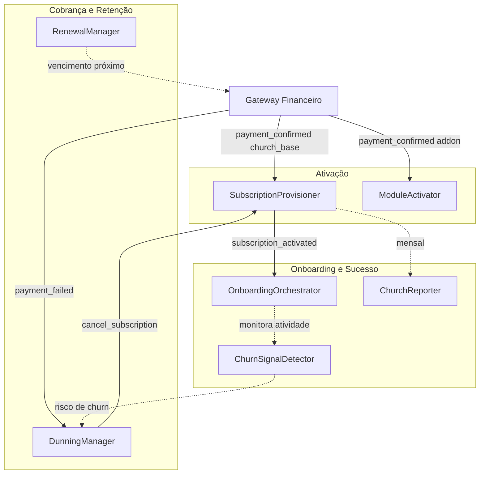

# Departamento SaaS Church Platform

> 7 agentes cobrindo o ciclo de vida completo do assinante: ativação, onboarding, retenção, cobrança e relatórios

---

## Diagrama do Ciclo de Vida



---

## SubscriptionProvisioner (`subscription_provisioner`)

| Campo | Valor |
|---|---|
| **agent_id** | `subscription_provisioner` |
| **Trigger** | Webhook `payment_confirmed` com `product_type = 'church_base'` |
| **Tools/MCPs** | `directus_mcp`, `http_tool` (Coolify webhook), `zernio_tool` (WhatsApp) |

**Responsabilidade:** Ativar a assinatura e provisionar a infraestrutura da Igreja no momento do primeiro pagamento.

**Fluxo:**
1. Valida assinatura do webhook (secret do gateway)
2. Cria `Church_Client` no Directus com dados do líder (nome, email, telefone, igreja)
3. Cria `Church_Subscriptions` com:
   - `plan_tier` vindo do produto pago
   - `status = 'active'`
   - Todos os `module_*` conforme o plano (starter: flags básicos, pro: todos)
   - `next_billing_date = hoje + 30 dias`
4. POST no Coolify webhook: provisiona container Docker da Church Platform para este cliente
5. Recebe `instance_url` e `admin_credentials` do Coolify
6. Atualiza `Church_Clients` com `directus_instance_url` e credenciais
7. Envia WhatsApp de boas-vindas ao líder via `zernio_tool`:
   - Credenciais de acesso à plataforma
   - Link do tutorial de primeiro acesso
8. Dispara `subscription_activated`

**Output:** `subscription_activated { church_id, subscription_id, instance_url }`

---

## ModuleActivator (`module_activator`)

| Campo | Valor |
|---|---|
| **agent_id** | `module_activator` |
| **Trigger** | Webhook `payment_confirmed` com `product_type = 'addon'` |
| **Tools/MCPs** | `directus_mcp`, `hermes_tool` |

**Responsabilidade:** Ativar um módulo adicional da Church Platform após compra do addon.

**Módulos disponíveis:**

| produto_addon | campo no Directus |
|---|---|
| `media_app` | `Church_Subscriptions.module_media_app` |
| `multi_church` | `Church_Subscriptions.module_multi_church` |
| `contributor_app` | `Church_Subscriptions.module_contributor_app` |
| `leader_app` | `Church_Subscriptions.module_leader_app` |
| `courses` | `Church_Subscriptions.module_courses` |

**Fluxo:**
1. Identifica `church_id` e `addon_type` do webhook
2. Atualiza o campo correspondente em `Church_Subscriptions` para `true`
3. Recalcula `addons_price` (soma dos módulos ativos × preço por módulo)
4. Envia email de confirmação ao líder via `hermes_tool`:
   - Módulo ativado e disponível imediatamente
   - Link para tutorial do módulo

**Output:** `module_activated { church_id, module_type, new_addons_price }`

---

## OnboardingOrchestrator (`onboarding_orchestrator`)

| Campo | Valor |
|---|---|
| **agent_id** | `onboarding_orchestrator` |
| **Trigger** | `subscription_activated` |
| **Tools/MCPs** | `directus_mcp` (Onboarding_Steps), `hermes_tool`, `zernio_tool` |

**Responsabilidade:** Conduzir o líder da igreja por uma sequência estruturada de onboarding nos primeiros 10 dias.

**Fluxo:**
```
subscription_activated recebido
  │
  ▼
Inicializa Church_Clients.onboarding_status = 'day0'
Cria registros de progresso para cada Onboarding_Step

Execução (cron diário verifica passos pendentes):
  Dia 0  → WhatsApp: credenciais + tour da plataforma
  Dia 2  → WhatsApp: "Você já cadastrou membros? Veja como →"
  Dia 5  → Email: guia de configuração financeira
  Dia 7  → WhatsApp: "Como está indo? Alguma dúvida?"
  Dia 10 → Email: convite para call de sucesso (Calendly link)

Cada passo:
  1. Busca template em Onboarding_Steps.template_key
  2. Renderiza com dados da igreja: {church_name}, {leader_name}, {platform_url}
  3. Envia via canal configurado (email/whatsapp)
  4. Atualiza Church_Clients.onboarding_status
```

**Conclusão:** Ao completar o Dia 10, `onboarding_status = 'completed'`

**Parametrização:** Todos os passos, templates e delays gerenciados em `Onboarding_Steps` no Directus — sem código para alterar a sequência.

---

## ChurnSignalDetector (`churn_signal_detector`)

| Campo | Valor |
|---|---|
| **agent_id** | `churn_signal_detector` |
| **Trigger** | Cron todo domingo às 22:00 |
| **Tools/MCPs** | `directus_mcp`, `telegram_tool`, `hermes_tool`, `zernio_tool` |

**Responsabilidade:** Detectar sinais de risco de churn e acionar reengajamento proativo.

**Fonte de dados:** `Church_Clients.last_activity_at` — atualizado automaticamente via n8n toda vez que a Church Platform emite um evento de atividade (login, criação de membro, evento, transação financeira).

**Fluxo:**
```
Para cada Church_Client com status = 'active':
  dias_inativo = hoje - last_activity_at

  Se dias_inativo >= 30:
    → Email de reengajamento via hermes_tool
    → WhatsApp: "Sentimos sua falta! Como podemos ajudar?"
    → Atualiza churn_risk_score = 80

  Se 14 <= dias_inativo < 30:
    → Telegram ao Sócio: "⚠️ {church_name} inativa há {dias} dias"
    → Atualiza churn_risk_score = 50

  Se dias_inativo < 14:
    → churn_risk_score = 0 (saudável)
```

**Integração com n8n:** A Church Platform emite eventos (`user.login`, `member.created`, `financial.transaction`) que o n8n 5impl captura e atualiza `Church_Clients.last_activity_at` no Directus. O agente apenas lê esse campo — sem acoplamento direto ao produto.

---

## RenewalManager (`renewal_manager`)

| Campo | Valor |
|---|---|
| **agent_id** | `renewal_manager` |
| **Trigger** | Cron diário às 07:00 |
| **Tools/MCPs** | `directus_mcp`, `hermes_tool`, `zernio_tool` |

**Responsabilidade:** Enviar lembretes de renovação proativos e monitorar falhas de cobrança recorrente.

**Fluxo:**
```
Para cada Church_Subscription com status='active':
  dias_para_vencimento = next_billing_date - hoje

  Se dias_para_vencimento = 7:
    → WhatsApp: "Sua assinatura renova em 7 dias. Tudo certo?"

  Se dias_para_vencimento = 3:
    → Email: "Renovação em 3 dias — confira se seu cartão está válido"

  Se dias_para_vencimento = 1:
    → WhatsApp: "Amanhã é dia de renovação 🔄"

  Se next_billing_date < hoje AND status ainda 'active':
    → Telegram ao Sócio: "⚠️ Cobrança não confirmada para {church_name}"
    (DunningManager assume se chegou webhook payment_failed)
```

---

## DunningManager (`dunning_manager`)

| Campo | Valor |
|---|---|
| **agent_id** | `dunning_manager` |
| **Trigger** | Webhook `payment_failed` do gateway |
| **Tools/MCPs** | `directus_mcp` (Dunning_Rules), `hermes_tool`, `zernio_tool`, `gateway_api_tool` |

**Responsabilidade:** Executar o fluxo de recuperação de inadimplência baseado em regras configuradas no Directus.

**Fluxo:**
```
Webhook payment_failed recebido:
  1. Salva em Payment_Failures: { subscription_id, failed_at, failure_reason }
  2. Atualiza dunning_status = 'in_progress'

Cron diário 06:00 — processa falhas em aberto:
  Para cada Payment_Failure com status != 'recovered'|'cancelled':
    dias_desde_falha = hoje - failed_at
    Busca Dunning_Rules WHERE trigger_days <= dias_desde_falha
                          AND ainda não executada
                          AND is_active = true

    Para cada regra aplicável:
      - 'notify_client': envia via canal configurado (WhatsApp/email/ambos)
      - 'retry_payment': chama gateway_api_tool para nova tentativa de cobrança
      - 'suspend_access': atualiza Church_Subscriptions.status = 'suspended'
      - 'cancel_subscription': status = 'cancelled' + dispara offboarding
```

**Exemplo de Dunning_Rules configuradas:**

| Dia | Ação | Canal |
|---|---|---|
| 0 | `notify_client` | whatsapp + email |
| 3 | `retry_payment` | — |
| 5 | `notify_client` | whatsapp |
| 7 | `suspend_access` | email |
| 14 | `cancel_subscription` | email |

**Recuperação:** Quando gateway envia `payment_confirmed` após falha → `DunningManager` atualiza `Payment_Failures.dunning_status = 'recovered'` e reativa o acesso.

---

## ChurchReporter (`church_reporter`)

| Campo | Valor |
|---|---|
| **agent_id** | `church_reporter` |
| **Trigger** | Cron dia 1 de cada mês às 08:00 |
| **Tools/MCPs** | `directus_mcp`, `hermes_tool` |

**Responsabilidade:** Gerar e enviar relatório mensal personalizado para cada líder de igreja.

**Fluxo:**
1. Para cada `Church_Client` com `subscription.status = 'active'`:
2. Consulta dados do mês via n8n (que agrega da Church Platform):
   - Membros adicionados, total ativo, novos visitantes
   - Doações: total, média por membro, comparativo mês anterior
   - Eventos realizados e número de participantes
   - Módulos mais utilizados
3. Gera relatório personalizado com insights em linguagem natural:
   - "Sua igreja cresceu X% este mês"
   - "As doações aumentaram R$ Y em relação ao mês passado"
4. Envia via `hermes_tool` para o email do líder

**Template:** Configurado em `Company_Settings.church_report_email_template`
