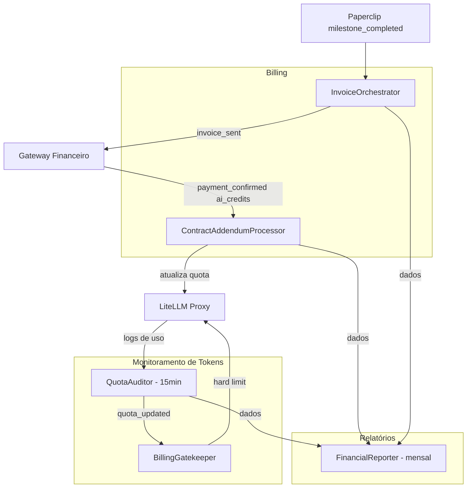

# Departamento Financeiro e Governança de Tokens

> 5 agentes cobrindo quota de LLM, billing recorrente, cobranças de consultoria e relatórios executivos

---

## Diagrama do Departamento



---

## QuotaAuditor (`quota_auditor`)

| Campo | Valor |
|---|---|
| **agent_id** | `quota_auditor` |
| **Trigger** | Cron a cada 15 minutos |
| **Tools/MCPs** | `litellm_api_tool`, `directus_mcp` |

**Responsabilidade:** Coletar logs de uso de tokens de TODOS os workspaces (clientes + 5impl interna) e persistir métricas no Directus para análise pelo `BillingGatekeeper` e `FinancialReporter`.

**Fluxo:**
```
A cada 15 minutos:
  1. Busca logs de uso do LiteLLM via API:
     GET /usage?start={last_run}&end=now
     Filtra por Virtual Key (todos os workspaces ativos)

  2. Para cada Virtual Key:
     - Agrega: tokens_input, tokens_output, custo_usd por modelo e por tag
     - Calcula percentage_used = consumo_atual / quota_limite × 100

  3. Salva/atualiza Token_Usage no Directus por key+date

  4. Dispara quota_updated para cada key com:
     { virtual_key_id, workspace_id, percentage_used, cost_usd_today }
```

**Scope monitorado:**
- `5impl-internal`: custo operacional dos próprios agentes da 5impl
- `client-{slug}`: consumo faturado ao cliente
- `church-{slug}`: consumo da Church Platform SaaS

---

## BillingGatekeeper (`billing_gatekeeper`)

| Campo | Valor |
|---|---|
| **agent_id** | `billing_gatekeeper` |
| **Trigger** | `quota_updated` |
| **Tools/MCPs** | `directus_mcp` (Gatekeepers), `litellm_api_tool`, `hermes_tool`, `zernio_tool` |

**Responsabilidade:** Executar ações automáticas quando o consumo atinge thresholds configurados, protegendo margens e evitando extrapolação de custos.

**Fluxo:**
```
quota_updated recebido { virtual_key_id, workspace_id, percentage_used }
  │
  ▼
1. Busca Gatekeepers WHERE applies_to = 'client' AND is_active = true
   Ordenados por threshold ASC

2. Para cada Gatekeeper com threshold <= percentage_used:
   Verifica se esta ação JÁ foi executada neste ciclo (evita spam)

   action = 'notify':
     Renderiza templateMessage com {company}, {threshold}, {cost_today}
     Envia via canal configurado (whatsapp/email/both/telegram)

   action = 'soft_block':
     Envia alerta urgente ao cliente E ao Sócio via Telegram
     (não bloqueia ainda — aviso crítico)

   action = 'hard_block':
     Chama litellm_api_tool: desabilita Virtual Key
     Envia notificação ao cliente: "Créditos esgotados. Recarregue para continuar."
     Notifica Sócio via Telegram

3. Mesmo fluxo para applies_to = 'internal' (monitoramento custo 5impl)
```

**Schema Gatekeepers (corrigido):**
```typescript
{
  id: UUID,
  name: string,          // ex: "80% Warning - Cliente"
  threshold: number,     // ex: 80
  action: 'notify' | 'soft_block' | 'hard_block',
  channel: 'whatsapp' | 'email' | 'both' | 'telegram',
  template_key: string,
  applies_to: 'client' | 'internal',
  is_active: boolean
}
```

---

## ContractAddendumProcessor (`contract_addendum_processor`)

| Campo | Valor |
|---|---|
| **agent_id** | `contract_addendum_processor` |
| **Trigger** | Webhook `payment_confirmed` com `product_type = 'ai_credits'` |
| **Tools/MCPs** | `litellm_api_tool`, `directus_mcp`, `gateway_api_tool`, `hermes_tool` |

**Responsabilidade:** Processar compras de créditos adicionais de IA com 3 tarefas atômicas obrigatórias.

**Fluxo (sequencial e obrigatório — falha em qualquer passo interrompe e alerta):**
```
Webhook payment_confirmed recebido {
  workspace_id, virtual_key_id, amount, credits_quantity, billing_type
}
  │
  ▼
Tarefa 1 — QUOTA UPDATE:
  LiteLLM API: incrementa quota da Virtual Key pelo valor comprado
  
Tarefa 2 — ADDENDUM REGISTRY:
  Directus: insere em Contract_Addendums {
    contract_id, item_type: 'ai_credits',
    quantity, added_price, billing_type
  }

Tarefa 3 — SUBSCRIPTION RECALCULATION:
  Directus: recalcula valor total da subscription:
    novo_valor = base_price + SUM(addendums recorrentes ativos)
  Gateway API: atualiza valor da assinatura recorrente
  
Confirmação:
  Hermes: email ao cliente "Recarga ativada. Novo limite: X tokens."
  WhatsApp: notificação de recarga ativa
```

**Garantia de atomicidade:** Se Tarefa 1 suceder mas Tarefa 2 falhar → registra falha e cria issue P2 no Paperclip para intervenção manual. Não faz rollback automático da quota (evitar interrupção de serviço).

---

## InvoiceOrchestrator (`invoice_orchestrator`)

| Campo | Valor |
|---|---|
| **agent_id** | `invoice_orchestrator` |
| **Trigger** | Issue `milestone_completed` no Paperclip (workspace 5impl) |
| **Tools/MCPs** | `directus_mcp`, `http_tool` (Puppeteer service), `hermes_tool` |

**Responsabilidade:** Gerar e enviar cobrança de milestone de projeto de consultoria.

**Fluxo:**
```
Issue milestone_completed detectada:
  - Extrai: contract_id, milestone_name, milestone_id

1. Busca Consulting_Milestones WHERE id = milestone_id
2. Busca dados do contrato: company_name, client_email, valor
3. Lê template de invoice em Company_Settings.invoice_html_template
4. Renderiza HTML com variáveis:
   {company_name}, {milestone_name}, {value}, {due_date}, {invoice_number}
5. POST no Puppeteer service → recebe PDF
6. Salva PDF path em Consulting_Milestones.invoice_pdf_path
7. Envia email ao cliente via hermes_tool com PDF em anexo
8. Atualiza Consulting_Milestones.status = 'invoiced'
9. Notifica Sócio via Telegram: "Invoice #{n} enviada para {company_name} — R$ {value}"
```

**Output:** `invoice_sent { milestone_id, invoice_path, amount }`

---

## FinancialReporter (`financial_reporter`)

| Campo | Valor |
|---|---|
| **agent_id** | `financial_reporter` |
| **Trigger** | Cron dia 1 de cada mês às 07:00 |
| **Tools/MCPs** | `directus_mcp`, `telegram_tool` |

**Responsabilidade:** Consolidar todas as fontes de receita, calcular métricas SaaS e enviar relatório executivo ao Sócio.

**Métricas calculadas:**

| Métrica | Fonte de Dados |
|---|---|
| **MRR** | `SUM(Church_Subscriptions.base_price + addons_price)` WHERE status='active' |
| **New MRR** | MRR de clientes ativados no mês |
| **Churned MRR** | MRR de clientes cancelados no mês |
| **Expansion MRR** | Novos aditivos recorrentes ativados no mês |
| **Consulting Revenue** | `SUM(Consulting_Payments.amount_received)` do mês |
| **Total Revenue** | MRR + Consulting Revenue |
| **Active Church Clients** | COUNT(Church_Subscriptions WHERE status='active') |
| **Churn Rate** | Churned MRR / MRR início do mês × 100 |
| **Avg Token Cost** | Token_Usage custo médio por cliente |

**Fluxo:**
1. Agrega dados do mês anterior de todas as fontes no Directus
2. Calcula todas as métricas acima
3. Salva snapshot em `Financial_Snapshots`
4. Gera relatório executivo em linguagem natural
5. Envia via `telegram_tool` ao Sócio com resumo + comparativo mês anterior
