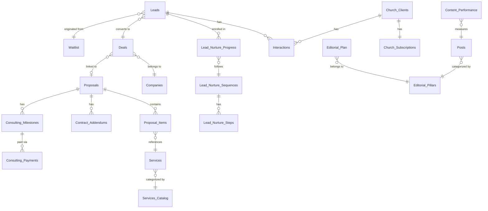

# Schemas do Directus — Especificação Completa

> Todas as coleções residem na instância Directus da **5impl.is** (`directus.5impl.is`), exceto onde indicado.

---

## Diagrama de Relacionamentos



---

## 1. CRM — Leads e Pipeline

### `Leads`
```typescript
interface Lead {
  id: string;                  // UUID (PK)
  name: string;
  email: string;               // único
  phone?: string;
  company_name?: string;
  source: 'waitlist' | 'zernio' | 'whatsapp' | 'referral' | 'direct';
  vertical: 'business' | 'church' | 'media';
  status: 'new' | 'nurturing' | 'qualified' | 'won' | 'lost' | 'disqualified';
  notes?: string;
  created_at: datetime;
  converted_at?: datetime;
  deal_id?: string;            // → Deals.id
}
```

### `Waitlist`
```typescript
interface WaitlistEntry {
  id: string;                  // UUID (PK)
  email: string;               // único
  name?: string;
  vertical: 'business' | 'church' | 'media';
  created_at: datetime;
  converted_to_lead: boolean;
  lead_id?: string;            // → Leads.id (ao converter)
}
```

### `Companies`
```typescript
interface Company {
  id: string;                  // UUID (PK)
  name: string;
  cnpj?: string;
  segment?: string;
  size: 'MEI' | 'small' | 'medium' | 'large';
  primary_contact_id?: string; // → Leads.id
  city?: string;
  state?: string;
  website?: string;
  paperclip_workspace_id?: string;
  directus_instance_url?: string;
  n8n_workspace_id?: string;
  litellm_virtual_key?: string;
}
```

### `Deals`
```typescript
interface Deal {
  id: string;                  // UUID (PK)
  lead_id: string;             // → Leads.id
  company_id?: string;         // → Companies.id
  stage: 'discovery' | 'proposal' | 'negotiation' | 'won' | 'lost';
  proposal_id?: string;        // → Proposals.id
  expected_value?: number;
  close_date?: date;
  notes?: string;
}
```

### `Interactions`
```typescript
interface Interaction {
  id: string;                  // UUID (PK)
  lead_id?: string;            // → Leads.id
  deal_id?: string;            // → Deals.id
  church_id?: string;          // → Church_Clients.id
  type: 'whatsapp' | 'email' | 'call' | 'note';
  direction: 'inbound' | 'outbound';
  content: string;
  agent_id: string;            // agent_id do agente que gerou
  created_at: datetime;
}
```

---

## 2. CRM — Nutrição de Leads

### `Lead_Nurture_Sequences`
```typescript
interface NurtureSequence {
  id: string;                  // UUID (PK)
  name: string;                // ex: "Church Waitlist — Pré-lançamento"
  vertical: 'business' | 'church' | 'media' | 'all';
  trigger_on_status: string;   // ex: "waitlist", "disqualified"
  is_active: boolean;
}
```

### `Lead_Nurture_Steps`
```typescript
interface NurtureStep {
  id: string;                  // UUID (PK)
  sequence_id: string;         // → Lead_Nurture_Sequences.id
  step_order: number;
  delay_days: number;          // dias após o step anterior
  channel: 'email' | 'whatsapp';
  subject?: string;            // para email
  body_template: string;       // suporta {name}, {vertical}, {company_name}
}
```

### `Lead_Nurture_Progress`
```typescript
interface NurtureProgress {
  id: string;                  // UUID (PK)
  lead_id: string;             // → Leads.id
  sequence_id: string;         // → Lead_Nurture_Sequences.id
  current_step: number;
  next_send_at?: datetime;
  status: 'active' | 'paused' | 'completed' | 'unsubscribed';
  started_at: datetime;
  last_sent_at?: datetime;
}
```

---

## 3. Vendas — Propostas e Contratos

### `Services_Catalog`
```typescript
interface ServiceCatalogItem {
  id: string;                  // UUID (PK)
  nome: string;                // ex: "Integrações Diversas"
  pricePerUnit: number;        // ex: 10.30
  addPerComplexity: number;    // % de acréscimo por nível: ex: 2.4
  i18nKey?: string;
}
```

### `Services`
```typescript
interface Service {
  id: string;                  // UUID (PK)
  tipoDeServico_id: string;    // → Services_Catalog.id
  nome: string;                // ex: "Integração Pipedrive CRM"
  default_complexity: number;  // 1–5
}
```

### `Proposals`
```typescript
interface Proposal {
  id: string;                  // UUID (PK)
  company_name: string;
  client_email: string;
  total_price: number;
  status: 'draft' | 'waiting_approval' | 'approved' | 'declined' | 'signed';
  contract_pdf_path?: string;
  signed_at?: datetime;
}
```

### `Proposal_Items`
```typescript
interface ProposalItem {
  id: string;                  // UUID (PK)
  proposal_id: string;         // → Proposals.id
  service_id: string;          // → Services.id
  quantity: number;
  overrideComplexity?: number;
  discountOrAcres?: string;    // ex: "-5%" ou "+150.00"
}
```

---

## 4. Financeiro — Billing e Tokens

### `Gatekeepers`
```typescript
interface Gatekeeper {
  id: string;                  // UUID (PK) — não usar string semântica
  name: string;                // ex: "80% Warning — Cliente"
  threshold: number;           // ex: 80
  action: 'notify' | 'soft_block' | 'hard_block';
  channel: 'whatsapp' | 'email' | 'both' | 'telegram';
  template_key: string;        // referência ao template de mensagem
  applies_to: 'client' | 'internal';
  is_active: boolean;
}
```

### `Dunning_Rules`
```typescript
interface DunningRule {
  id: string;                  // UUID (PK)
  name: string;                // ex: "Dia 0 — Aviso inicial"
  trigger_days: number;        // dias após payment_failed
  action: 'notify_client' | 'retry_payment' | 'suspend_access' | 'cancel_subscription';
  channel: 'whatsapp' | 'email' | 'both';
  template_key: string;
  grace_period_hours: number;
  is_active: boolean;
}
```

### `Contract_Addendums`
```typescript
interface ContractAddendum {
  id: string;                  // UUID (PK)
  contract_id: string;         // → Proposals.id
  item_type: string;           // ex: "ai_credits", "extra_module"
  quantity: number;
  added_price: number;
  billing_type: 'one_time' | 'recurring';
  created_at: datetime;
}
```

### `Consulting_Milestones`
```typescript
interface ConsultingMilestone {
  id: string;                  // UUID (PK)
  contract_id: string;         // → Proposals.id
  name: string;                // ex: "Entrega Fase 1 — n8n workflows"
  value: number;
  due_date: date;
  status: 'pending' | 'invoiced' | 'paid' | 'overdue';
  invoice_pdf_path?: string;
}
```

### `Consulting_Payments`
```typescript
interface ConsultingPayment {
  id: string;                  // UUID (PK)
  milestone_id: string;        // → Consulting_Milestones.id
  amount_received: number;
  payment_date: date;
  payment_method?: string;
  notes?: string;
}
```

### `Token_Usage`
```typescript
interface TokenUsage {
  id: string;                  // UUID (PK)
  virtual_key_id: string;
  workspace_id: string;
  date: date;
  tokens_input: number;
  tokens_output: number;
  cost_usd: number;
  model: string;
  tag: string;                 // ex: "editorial.content_writer"
}
```

### `Payment_Failures`
```typescript
interface PaymentFailure {
  id: string;                  // UUID (PK)
  subscription_id: string;     // → Church_Subscriptions.id
  gateway_payment_id: string;
  failure_reason: string;
  failed_at: datetime;
  dunning_status: 'pending' | 'in_progress' | 'recovered' | 'cancelled';
}
```

### `Financial_Snapshots`
```typescript
interface FinancialSnapshot {
  id: string;                  // UUID (PK)
  snapshot_date: date;
  mrr: number;
  new_mrr: number;
  churned_mrr: number;
  expansion_mrr: number;
  consulting_revenue: number;
  total_revenue: number;
  active_church_clients: number;
  new_clients: number;
  churned_clients: number;
}
```

---

## 5. Editorial

### `Editorial_Pillars`
```typescript
interface EditorialPillar {
  id: string;
  name: string;                // ex: "Automação e IA Aplicada"
  slug: string;
  trend_keywords: string[];    // termos-semente para EditorialPlanner
  min_posts_per_month: number;
  target_audience: string;
  is_active: boolean;
  priority_weight: number;     // 1–10, influencia distribuição do calendário
}
```

### `Editorial_Plan`
```typescript
interface EditorialPlanEntry {
  id: string;
  title: string;
  pillar_id: string;           // → Editorial_Pillars.id
  target_keywords: string[];
  status: 'planned' | 'in_progress' | 'review' | 'published' | 'archived';
  scheduled_for: date;
  content_brief: string;
  performance_score?: number;  // preenchido pelo ContentAnalyst
  assigned_format: 'article' | 'thread' | 'carousel';
  asset_strategy_override?: 'ai_generated' | 'canva_template' | 'manual';
}
```

### `Content_Channels`
```typescript
interface ContentChannel {
  id: string;
  channel: 'blog' | 'linkedin' | 'instagram' | 'newsletter' | 'youtube';
  asset_strategy: 'ai_generated' | 'canva_template' | 'manual';
  canva_template_id?: string;
  ai_image_style?: string;     // ex: "minimalist dark, tech, no text"
  ai_image_model?: 'dall-e-3' | 'ideogram' | 'flux';
  tone?: string;
  max_chars?: number;
  hashtag_count?: number;
  posting_time?: time;
  is_active: boolean;
}
```

### `Social_Editorial_Rules`
```typescript
interface SocialEditorialRule {
  id: string;
  platform: string;
  tone_guidelines: string;
  prohibited_terms: string[];
  brand_hashtags: string[];
  emoji_usage: string;
  cta_templates: string[];
}
```

### `Posts`
```typescript
interface Post {
  id: string;
  title: string;
  slug: string;                // único
  body: string;                // Markdown
  excerpt?: string;
  meta_title?: string;
  meta_description?: string;
  focus_keyword?: string;
  pillar_id: string;           // → Editorial_Pillars.id
  status: 'draft' | 'review' | 'published' | 'archived';
  published_at?: datetime;
  author: string;
  cover_image_url?: string;
  estimated_read_time?: number; // minutos
}
```

### `Content_Performance`
```typescript
interface ContentPerformance {
  id: string;
  post_id: string;             // → Posts.id
  platform: string;
  views: number;
  clicks: number;
  shares: number;
  comments: number;
  engagement_rate: number;
  measured_at: datetime;
}
```

---

## 6. Church Platform

### `Church_Clients`
```typescript
interface ChurchClient {
  id: string;
  church_name: string;
  leader_name: string;
  leader_email: string;
  leader_phone?: string;
  city?: string;
  state?: string;
  subscription_id: string;     // → Church_Subscriptions.id
  paperclip_workspace_id?: string;
  directus_instance_url?: string;
  n8n_workspace_id?: string;
  onboarding_status: 'pending' | 'day0' | 'day2' | 'day5' | 'day7' | 'day10' | 'completed';
  last_activity_at?: datetime; // atualizado via n8n webhook
  churn_risk_score: number;    // 0–100
}
```

### `Church_Subscriptions`
```typescript
interface ChurchSubscription {
  id: string;
  church_id: string;           // → Church_Clients.id
  plan_tier: 'starter' | 'growth' | 'pro' | 'enterprise';
  status: 'trial' | 'active' | 'suspended' | 'cancelled';
  // Feature flags por módulo (consultados pela Church Platform API)
  module_media_app: boolean;
  module_multi_church: boolean;
  module_contributor_app: boolean;
  module_leader_app: boolean;
  module_courses: boolean;
  // Billing
  base_price: number;
  addons_price: number;
  next_billing_date: date;
  gateway_subscription_id: string;
}
```

### `Onboarding_Steps`
```typescript
interface OnboardingStep {
  id: string;
  step_order: number;
  day_offset: number;          // dias após subscription_activated
  channel: 'whatsapp' | 'email';
  subject?: string;            // para email
  template_key: string;        // chave do template
  description: string;         // uso interno/documentação
}
```

---

## 7. Configurações Globais

### `Company_Settings`
```typescript
interface CompanySetting {
  key: string;                 // PK — ex: "max_active_projects"
  value: string;
  description: string;
  type: 'string' | 'integer' | 'boolean' | 'json';
}
```

**Chaves obrigatórias:**

| key | type | Usado por |
|---|---|---|
| `max_active_projects` | integer | CapacityMonitor |
| `availability_flag` | string | CapacityMonitor → SalesQualifier |
| `cloudflare_build_webhook` | string | StaticSitePublisher |
| `ceo_telegram_chat_id` | string | CEO, IncidentDispatcher |
| `contract_template_html` | string | ContractCompiler |
| `invoice_html_template` | string | InvoiceOrchestrator |
| `church_report_email_template` | string | ChurchReporter |
| `content_scoring_weights` | json | ContentAnalyst |
| `support_escalation_keywords` | json | OnCallSupport |
| `governance_spec_git_ref` | string | GovernanceAuditor |
| `top_performing_pillars` | json | EditorialPlanner |
