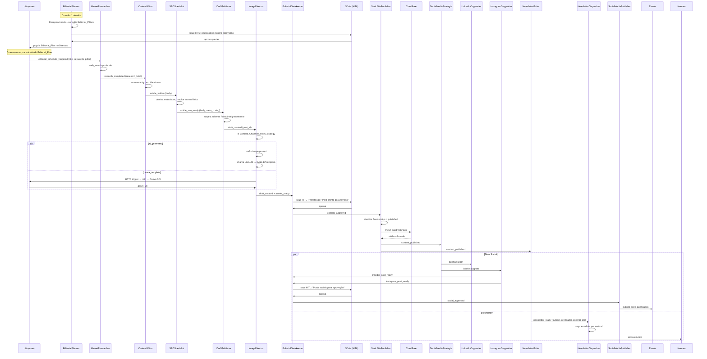

# Fluxo: Pipeline de Conteúdo

> Editorial → Aprovação → Publicação → Social → Newsletter

---

## Diagrama de Sequência Completo



---

## Payloads de Transferência

### `editorial_schedule_triggered`
```json
{
  "plan_entry_id": "uuid",
  "title": "Como automatizar o onboarding de clientes em 2025",
  "pillar": "automation",
  "target_keywords": ["onboarding automático", "automação B2B"],
  "content_brief": "Focar em casos práticos com n8n e Paperclip",
  "scheduled_for": "2025-06-15",
  "format": "article"
}
```

### `research_completed`
```json
{
  "plan_entry_id": "uuid",
  "research_brief": {
    "overview": "...",
    "key_stats": ["X% das empresas...", "Estudo Y mostra..."],
    "expert_angles": ["..."],
    "practical_examples": ["..."],
    "sources": ["url1", "url2"]
  }
}
```

### `article_seo_ready`
```json
{
  "plan_entry_id": "uuid",
  "title": "...",
  "body": "## Markdown completo...",
  "slug": "como-automatizar-onboarding-clientes-2025",
  "meta_title": "Como automatizar onboarding de clientes | 5impl",
  "meta_description": "Guia prático de automação de onboarding...",
  "focus_keyword": "automação de onboarding",
  "estimated_read_time": 8,
  "internal_links": [{ "text": "saiba mais sobre n8n", "slug": "o-que-e-n8n" }]
}
```

### `draft_created`
```json
{
  "post_id": "uuid",
  "title": "...",
  "slug": "...",
  "directus_url": "https://directus.5impl.is/items/posts/uuid"
}
```

### `content_published`
```json
{
  "post_id": "uuid",
  "title": "...",
  "url": "https://5impl.is/pt/blog/como-automatizar-onboarding-clientes-2025",
  "published_at": "2025-06-15T10:00:00Z",
  "pillar": "automation",
  "excerpt": "..."
}
```

---

## Tratamento de Erros

| Ponto de Falha | Comportamento |
|---|---|
| `MarketResearcher` sem resultados | Retorna `research_brief` parcial com flag `low_confidence`; `ContentWriter` usa brief disponível |
| `ImageDirector` falha no DALL-E | Tenta modelo alternativo (Ideogram); se falhar → usa imagem placeholder do pilar |
| Build Cloudflare falha | `StaticSitePublisher` cria issue no Paperclip + Telegram ao Sócio; post permanece `published` no Directus |
| `EditorialGatekeeper` recebe `declined` | Notifica agente anterior com feedback; cria sub-issue de revisão |
| Zernio API indisponível | `SocialMediaPublisher` cria issue de retry + agenda nova tentativa via n8n |
