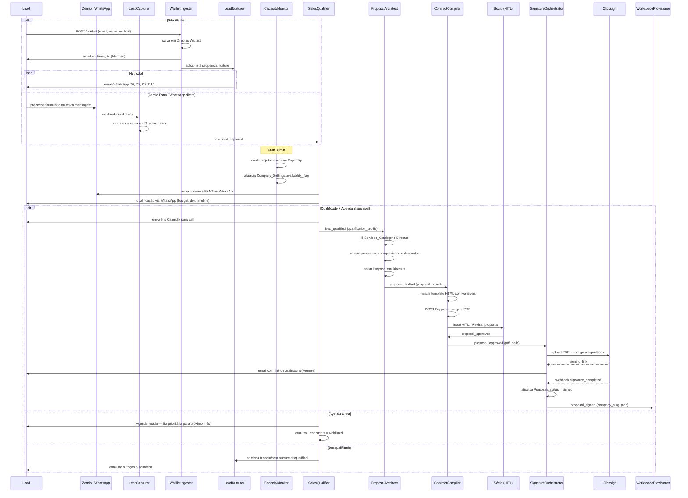

# Fluxo: Lead → Contrato

> Captura → Qualificação → Proposta → Assinatura → Provisionamento

---

## Diagrama de Sequência



---

## Estados do Lead

```
new → nurturing → qualified → [won | lost | disqualified]
         ↑
    waitlisted (agenda cheia)
```

---

## Lógica de Preço da Proposta

```
Para cada Proposal_Item:
  base_price = Services.default_complexity × Services_Catalog.addPerComplexity

  Se overrideComplexity definido:
    complexity = overrideComplexity
  Senão:
    complexity = Services.default_complexity

  unit_price = Services_Catalog.pricePerUnit × (1 + complexity × addPerComplexity / 100)

  Se discountOrAcres:
    Se começa com '-': aplica desconto percentual ou absoluto
    Se começa com '+': aplica acréscimo percentual ou absoluto

  item_total = unit_price × quantity

total_price = SUM(item_total)
```

---

## Payloads Chave

### `lead_qualified`
```json
{
  "lead_id": "uuid",
  "vertical": "business",
  "qualification_profile": {
    "budget_range": "R$ 5k–10k/mês",
    "main_pain": "Processo de onboarding de clientes 100% manual",
    "timeline": "Quer começar em 30 dias",
    "company_size": "small",
    "decision_maker": true
  }
}
```

### `proposal_drafted`
```json
{
  "proposal_id": "uuid",
  "company_name": "Empresa XYZ",
  "client_email": "cto@xyz.com",
  "items": [
    {
      "service": "Integração Pipedrive CRM",
      "complexity": 3,
      "quantity": 1,
      "unit_price": 850.00,
      "discount": "-5%",
      "total": 807.50
    }
  ],
  "total_price": 807.50
}
```

### `proposal_signed`
```json
{
  "proposal_id": "uuid",
  "company_slug": "empresa-xyz",
  "company_name": "Empresa XYZ",
  "client_email": "cto@xyz.com",
  "plan_limits": {
    "token_quota_monthly": 500000,
    "litellm_virtual_key": "sk-client-xyz"
  }
}
```
