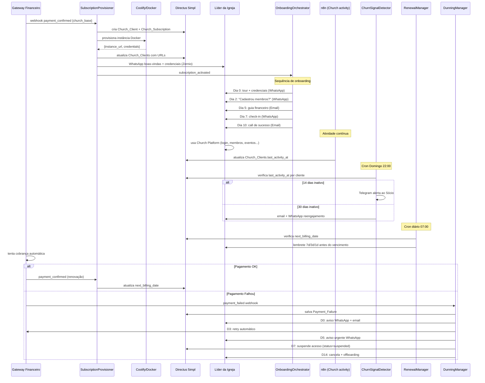

# Fluxo: Ciclo de Vida Church SaaS

> Pagamento → Ativação → Onboarding → Retenção → Dunning → Offboarding

---

## Diagrama de Sequência



---

## Mapa de Módulos por Plano

| Módulo | Starter | Growth | Pro | Enterprise |
|---|---|---|---|---|
| Membros, Financeiro, Eventos | ✅ | ✅ | ✅ | ✅ |
| Cursos, Sermões | ❌ | ✅ | ✅ | ✅ |
| App do Líder, App do Contribuinte | ❌ | ❌ | ✅ | ✅ |
| Multi-Igreja (filiais) | ❌ | ❌ | ❌ | ✅ |
| Media App | Addon | Addon | Addon | Addon |

**Módulos Addon** (comprados separadamente via `ModuleActivator`):
- Media App (`module_media_app`)

---

## Como a Church Platform Verifica Feature Flags

```
Igreja acessa URL de funcionalidade premium
  │
  ▼
Church Platform API → GET /api/subscription/{church_id}/modules
  │
  ▼
Directus 5impl: SELECT module_* FROM Church_Subscriptions WHERE church_id = ?
  │
  ├── module_media_app = true → permite acesso
  └── module_media_app = false → retorna 403 com upgrade CTA
```

A Church Platform NUNCA acessa o CRM interno da 5impl — apenas a coleção `Church_Subscriptions` via API key dedicada com permissão read-only nessa coleção.

---

## Estados de Assinatura

```
trial → active → suspended → cancelled
                    ↑            ↑
               (dunning D7)  (dunning D14)
                    ↓
                 active (se pagamento recuperado)
```

---

## Payloads Chave

### `subscription_activated`
```json
{
  "church_id": "uuid",
  "subscription_id": "uuid",
  "instance_url": "https://church-xyz.app.5impl.is",
  "plan_tier": "growth",
  "modules": {
    "module_media_app": false,
    "module_multi_church": false,
    "module_contributor_app": false,
    "module_leader_app": false,
    "module_courses": true
  }
}
```

### `payment_failed`
```json
{
  "subscription_id": "uuid",
  "church_id": "uuid",
  "gateway_payment_id": "ch_xxx",
  "failure_reason": "insufficient_funds",
  "failed_at": "2025-06-01T10:00:00Z"
}
```
