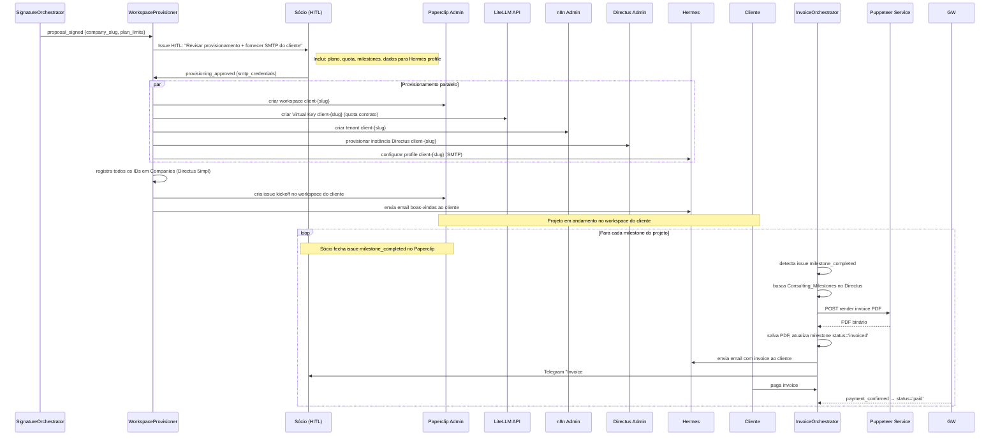

# Fluxo: Entrega de Consultoria

> Pós-assinatura → Provisionamento → Kickoff → Milestones → Invoice → Encerramento

---

## Diagrama de Sequência



---

## Checklist de Provisionamento

O `WorkspaceProvisioner` valida cada passo antes de prosseguir:

| # | Recurso | Ferramenta | Verificação |
|---|---|---|---|
| 1 | Workspace Paperclip | `paperclip_agent_manager` | workspace_id retornado |
| 2 | Virtual Key LiteLLM | `litellm_api_tool` | key ativa e com quota configurada |
| 3 | Tenant n8n | `http_tool` (n8n admin API) | workspace_id retornado |
| 4 | Instância Directus | `http_tool` (Directus admin) | URL acessível (200 OK) |
| 5 | Profile Hermes | Hermes adapter | teste de envio de email |
| 6 | Registro no CRM | `directus_mcp` | Companies.id salvo |
| 7 | Issue kickoff | `paperclip_issues_tool` | issue_url retornada |
| 8 | Email boas-vindas | `hermes_tool` | enviado sem erro |

**Em caso de falha:** cria issue no Paperclip com o step que falhou e o erro. Não executa rollback automático. O Sócio deve decidir como proceder.

---

## Estrutura de Milestones Padrão

Configurável no `ContractCompiler` com base no tipo de projeto:

| Tipo de Projeto | Milestone 1 | Milestone 2 | Milestone 3 |
|---|---|---|---|
| Automação completa | Mapeamento e setup (30%) | Desenvolvimento e testes (50%) | Entrega e treinamento (20%) |
| Integração pontual | Setup e configuração (50%) | Entrega e ajustes (50%) | — |
| Consultoria mensal | Retainer mensal | Retainer mensal | ... |

---

## Payload: `workspace_provisioned`
```json
{
  "company_id": "uuid",
  "company_slug": "empresa-xyz",
  "resources": {
    "paperclip_workspace_id": "ws_xyz",
    "litellm_virtual_key": "sk-client-xyz",
    "n8n_workspace_id": "n8n_xyz",
    "directus_instance_url": "https://directus.client-xyz.com",
    "hermes_profile": "client-xyz"
  },
  "provisioned_at": "2025-06-01T10:00:00Z"
}
```
