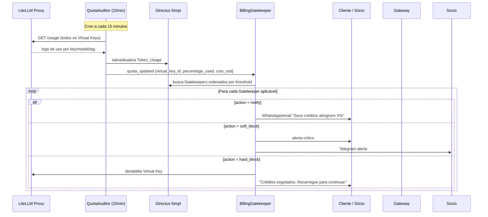
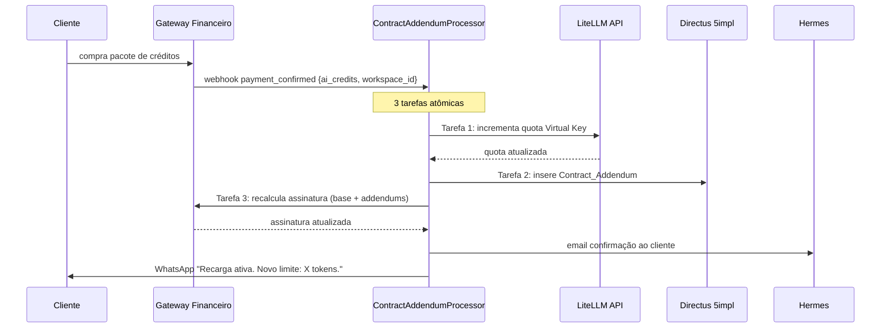
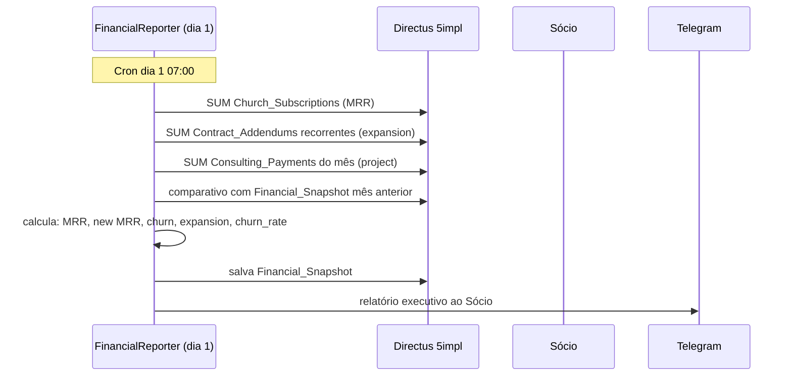

# Fluxo: Billing e Governança de Tokens

> Quota Monitoring → Gatekeepers → Recargas → Relatório Financeiro

---

## Diagrama: Loop de Quota (LiteLLM)



---

## Diagrama: Recarga de Créditos (Addendum)



---

## Diagrama: Relatório Financeiro Mensal



---

## Configuração de Gatekeepers (Exemplo)

```json
[
  {
    "name": "70% Warning — Cliente",
    "threshold": 70,
    "action": "notify",
    "channel": "whatsapp",
    "template_key": "quota_70_client",
    "applies_to": "client",
    "is_active": true
  },
  {
    "name": "90% Soft Block — Cliente",
    "threshold": 90,
    "action": "soft_block",
    "channel": "both",
    "template_key": "quota_90_client",
    "applies_to": "client",
    "is_active": true
  },
  {
    "name": "100% Hard Block — Cliente",
    "threshold": 100,
    "action": "hard_block",
    "channel": "email",
    "template_key": "quota_100_client",
    "applies_to": "client",
    "is_active": true
  },
  {
    "name": "80% Warning — Interno",
    "threshold": 80,
    "action": "notify",
    "channel": "telegram",
    "template_key": "quota_80_internal",
    "applies_to": "internal",
    "is_active": true
  }
]
```

---

## Formato do Relatório Financeiro (Telegram)

```
📊 Relatório Mensal 5impl — Maio 2025

💰 Receita
  MRR:              R$ 12.450
  Consultoria:      R$  8.200
  Total:            R$ 20.650

📈 MRR Movement
  New MRR:         +R$  2.100
  Expansion MRR:   +R$    450
  Churned MRR:     -R$    800
  Net New MRR:     +R$  1.750

🏛️ Church Platform
  Clientes ativos:     18
  Novos este mês:       3
  Cancelamentos:        1
  Churn Rate:         5.3%

⚡ Tokens
  Custo total 5impl: $  42.30
  Maior consumidor:  editorial.content_writer ($12.80)

vs. Abril: +12.4% receita total ✅
```
