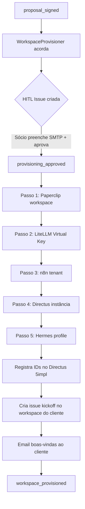

# Provisionamento de Workspace

> Setup completo de um novo workspace de cliente de consultoria

---

## Visão Geral

O provisionamento é acionado pelo `WorkspaceProvisioner` após a assinatura do contrato. Inclui um HITL obrigatório antes de qualquer recurso ser criado.



---

## Issue HITL — Template

Quando o `WorkspaceProvisioner` é acionado, cria esta issue no Paperclip 5impl para o Sócio:

```markdown
## Provisionar Workspace: {company_name}

**Contrato:** #{proposal_id}
**Plano:** {plan_tier}
**Token Quota:** {token_quota}/mês
**Valor mensal:** R$ {total_price}

### Milestones do Projeto
- [ ] Milestone 1: {name} — R$ {value} — Prazo: {due_date}
- [ ] Milestone 2: {name} — R$ {value} — Prazo: {due_date}

### Configurações Pendentes (preencher antes de aprovar)
- **SMTP Host do cliente:** ___________
- **SMTP Port:** ___________
- **SMTP User:** ___________
- **SMTP Password:** ___________
- **From Email:** ___________

### Recursos que serão criados
- Paperclip workspace: `client-{slug}`
- LiteLLM Virtual Key: `client-{slug}` (quota: {quota} tokens/mês)
- n8n tenant: `client-{slug}`
- Directus instance: `https://directus.{slug}.client.5impl.is`
- Hermes profile: `{slug}`

[✅ Aprovar e Provisionar] [❌ Cancelar]
```

---

## Script de Setup (n8n interno da 5impl)

O n8n da 5impl tem um workflow dedicado `workspace-bootstrap` que pode ser usado para setup manual ou como fallback:

```javascript
// n8n Workflow: workspace-bootstrap
// Triggered by: HTTP POST /webhook/provision-workspace

const { company_slug, plan_limits, smtp_credentials } = $input.body;

// 1. Paperclip workspace
const paperclipWs = await $http.post('${PAPERCLIP_API}/workspaces', {
  name: `client-${company_slug}`,
  plan: plan_limits.paperclip_tier
});

// 2. LiteLLM Virtual Key
const litellmKey = await $http.post('${LITELLM_API}/key/generate', {
  key_alias: `client-${company_slug}`,
  max_budget: plan_limits.token_quota_monthly,
  metadata: { workspace: company_slug }
});

// 3. n8n tenant (via n8n Cloud API ou self-hosted admin)
const n8nTenant = await $http.post('${N8N_ADMIN_API}/tenants', {
  name: company_slug
});

// 4. Directus instance (via Coolify ou similar)
const directusInstance = await $http.post('${COOLIFY_API}/v1/deploy', {
  template: 'directus',
  name: `directus-${company_slug}`,
  env_vars: { /* Directus env */ }
});

// 5. Hermes profile
await $http.post('${HERMES_API}/profiles', {
  name: company_slug,
  smtp: smtp_credentials
});

// 6. Registra tudo no Directus 5impl
await $http.patch(`${DIRECTUS_5IMPL}/items/companies/${company_id}`, {
  paperclip_workspace_id: paperclipWs.id,
  litellm_virtual_key: litellmKey.key,
  n8n_workspace_id: n8nTenant.id,
  directus_instance_url: directusInstance.url
});
```

---

## Checklist de Validação Pós-Provisionamento

Após o `WorkspaceProvisioner` concluir, o Sócio deve verificar:

- [ ] Login no Paperclip workspace `client-{slug}` funciona
- [ ] Virtual Key aparece no painel LiteLLM com quota correta
- [ ] n8n tenant acessível e operacional
- [ ] Directus instância responde em `/server/health`
- [ ] Hermes: teste de envio de email do profile do cliente
- [ ] Email de boas-vindas recebido pelo cliente
- [ ] Milestones criados no Directus 5impl

---

## Offboarding de Workspace (Encerramento de Contrato)

Quando um projeto de consultoria é encerrado, os recursos devem ser desprovisionados:

```markdown
Checklist de Offboarding (executado manualmente pelo Sócio):
- [ ] Exportar dados do Directus do cliente (dump completo)
- [ ] Exportar workflows n8n do tenant do cliente
- [ ] Notificar cliente sobre prazo de acesso (30 dias)
- [ ] Após prazo: desabilitar Virtual Key LiteLLM
- [ ] Arquivar workspace Paperclip
- [ ] Encerrar tenant n8n
- [ ] Backup final + shutdown instância Directus
- [ ] Atualizar Companies.status = 'archived' no Directus 5impl
```

> O offboarding não é automatizado intencionalmente — perda de dados de cliente requer confirmação humana explícita.
