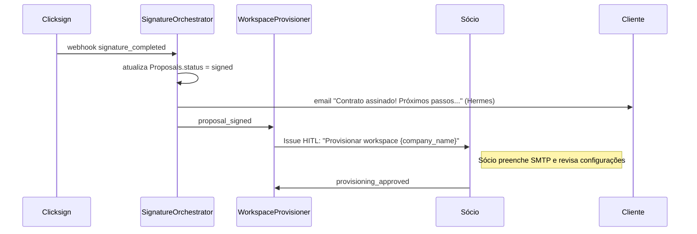
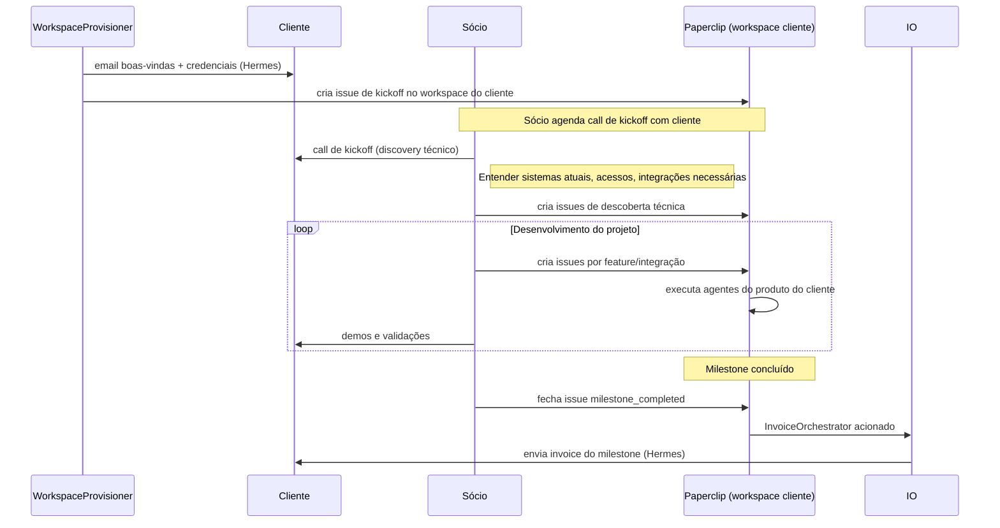

# Onboarding — Consultoria (Pós-Contrato)

> Sequência pós-assinatura de contrato e pós-provisionamento de workspace

---

## Fase 1: Pós-Assinatura (antes do provisionamento)

Imediatamente após `proposal_signed`, o `SignatureOrchestrator` envia confirmação e o `WorkspaceProvisioner` inicia o processo.



### Email de Confirmação de Assinatura
**Subject:** Contrato assinado — bem-vindo(a) à 5impl! 🎉

```
Olá, {client_name}!

Seu contrato foi assinado com sucesso. Estamos muito felizes em ter você como cliente da 5impl!

O que acontece agora:
1. Nossa equipe vai preparar seu ambiente de trabalho
2. Em até 24h úteis você receberá as credenciais de acesso
3. Vamos agendar nossa call de kickoff

Resumo do seu projeto:
{services_summary}

Valor mensal: R$ {total_price}

Dúvidas? Responda este email ou nos chame no WhatsApp.
```

---

## Fase 2: Pós-Provisionamento (após workspace_provisioned)



### Email de Boas-vindas (Pós-Provisionamento)
**Subject:** Seu ambiente está pronto — vamos começar!

```
Olá, {client_name}!

Seu ambiente de automação já está configurado e pronto para uso.

🔑 Credenciais de Acesso:

Paperclip (gerenciamento do projeto):
  URL: {paperclip_workspace_url}
  Email: {client_email}
  Senha provisória: {temp_password}

n8n (workflows de automação):
  URL: {n8n_workspace_url}
  (Login com as mesmas credenciais)

Directus (banco de dados e APIs):
  URL: {directus_url}
  (Credenciais em anexo)

📋 Próximos passos:
1. Acesse o Paperclip e confira a issue de kickoff
2. Responda este email para agendarmos nossa call de kickoff
3. Prepare os acessos aos sistemas que vamos integrar

Estamos empolgados para começar! 🚀
```

---

## Checklist de Kickoff (para o Sócio)

Issue criada automaticamente no workspace do cliente pelo `WorkspaceProvisioner`:

```markdown
## Kickoff — {company_name}

### Pré-call (antes da reunião de kickoff)
- [ ] Cliente acessou o Paperclip
- [ ] Cliente acessou o n8n
- [ ] Apresentar o fluxo de trabalho (issues → milestones → invoice)

### Durante a call de kickoff
- [ ] Revisar scope do contrato ponto a ponto
- [ ] Mapear sistemas existentes (CRMs, ERPs, planilhas, e-mails)
- [ ] Solicitar credenciais de acesso necessárias
- [ ] Definir protocolo de comunicação (WhatsApp + Paperclip)
- [ ] Alinhar expectativas de prazo por milestone

### Pós-call
- [ ] Criar issues de descoberta técnica por sistema
- [ ] Configurar Hermes profile com SMTP do cliente
- [ ] Integrar primeiras ferramentas do cliente

### Milestones do Projeto
{milestones_list}
```

---

## Comunicação Contínua Durante o Projeto

| Canal | Tipo de Comunicação |
|---|---|
| **Paperclip (workspace cliente)** | Issues de features, bugs, milestones, decisões técnicas |
| **WhatsApp (Hermes profile do cliente)** | Comunicações informais, lembretes, demos rápidas |
| **Email (@5impl.is)** | Invoices, contratos, comunicações formais |
| **Telegram** | Alertas do Sócio quando milestone está concluído |

---

## Pesquisa de Satisfação (30 dias após workspace_provisioned)

Enviada automaticamente pelo `SatisfactionSurveyor` (agente planejado para fase futura):

**Subject:** Como está sendo sua experiência com a 5impl?

```
Olá, {client_name}!

Faz 30 dias desde que começamos a trabalhar juntos. Adoraríamos saber como você está se sentindo com o projeto.

1. De 0 a 10, qual a probabilidade de recomendar a 5impl para alguém?

2. O que tem funcionado melhor até agora?

3. O que poderíamos melhorar?

Responda este email ou use o link → {nps_form_url}

Obrigado pelo feedback! Ele é fundamental para continuarmos evoluindo.
```
