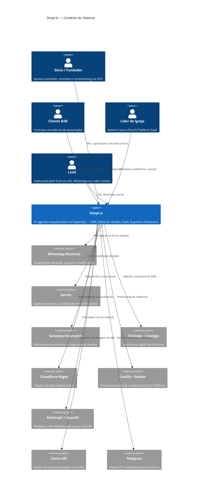

# 5impl.is — Especificação Técnica Completa

> Versão: 1.0 · Stack: Paperclip + Directus + n8n + LiteLLM + Hermes · 41 Agentes

Esta especificação consolida o design completo do sistema de automação da **5impl.is** — desde a arquitetura multi-tenant até o catálogo de agentes, schemas de banco de dados, fluxos operacionais, integrações e scripts de provisionamento.

---

## Diagrama de Contexto (C4 — Nível 1)

---

## Índice de Navegação

### 01 — Arquitetura
| Documento | Descrição |
|---|---|
| [C1 — Contexto](./01-architecture/c1-context.md) | Atores, sistemas externos e fronteiras do sistema |
| [C2 — Containers](./01-architecture/c2-containers.md) | Componentes técnicos internos e comunicação |
| [Multi-Tenant](./01-architecture/multi-tenant.md) | Isolamento de workspaces e fronteiras de dados |

### 02 — Catálogo de Agentes
| Documento | Agentes |
|---|---|
| [Índice Geral](./02-agents/README.md) | Todos os 41 agentes — referência rápida |
| [Executivo](./02-agents/01-executive.md) | CEO, GovernanceAuditor |
| [Editorial & Marketing](./02-agents/02-editorial.md) | 15 agentes do pipeline de conteúdo |
| [Vendas & Leads](./02-agents/03-sales.md) | 8 agentes do funil comercial |
| [SaaS Church](./02-agents/04-saas-church.md) | 7 agentes do produto e customer success |
| [Suporte & Infra](./02-agents/05-support.md) | OnCallSupport, IncidentDispatcher, KnowledgeDocumenter |
| [Financeiro](./02-agents/06-financial.md) | 5 agentes de billing e governança de tokens |

### 03 — Schemas e Dados
| Documento | Conteúdo |
|---|---|
| [Visão Geral dos Schemas](./03-schemas/README.md) | Todas as coleções Directus com campos, tipos e relações |
| [Script Bootstrap](./03-schemas/bootstrap.ts) | Provisionamento automático de todas as coleções |

### 04 — Fluxos Operacionais
| Documento | Fluxo |
|---|---|
| [Pipeline de Conteúdo](./04-flows/01-content-pipeline.md) | Editorial → Aprovação → Publicação → Social → Newsletter |
| [Lead → Contrato](./04-flows/02-lead-to-contract.md) | Captura → Qualificação → Proposta → Assinatura |
| [Ciclo de Vida Church SaaS](./04-flows/03-church-lifecycle.md) | Subscrição → Onboarding → Retenção → Dunning → Offboarding |
| [Entrega de Consultoria](./04-flows/04-consulting-delivery.md) | Pós-assinatura → Provisionamento → Milestones → Invoice |
| [Billing & Tokens](./04-flows/05-financial-billing.md) | Quota → Gatekeepers → Aditivos → Relatório Financeiro |

### 05–08 — Operações e Configuração
| Documento | Conteúdo |
|---|---|
| [Integrações Externas](./05-integrations/README.md) | Spec de todas as APIs externas e padrões de integração |
| [Provisionamento de Workspace](./06-provisioning/README.md) | Setup completo de novo workspace de cliente |
| [Onboarding Church](./07-onboarding/church.md) | Sequência pós-ativação de assinatura SaaS |
| [Onboarding Consultoria](./07-onboarding/consulting.md) | Sequência pós-assinatura de contrato |
| [Parametrização via Directus](./08-parametrization/README.md) | Como agentes lêem configurações dinâmicas do banco |

---

## Princípios Arquiteturais

| Princípio | Definição |
|---|---|
| **SoC** | Cada agente tem exatamente uma responsabilidade |
| **Agente vs n8n** | Agentes para integrações que exigem inteligência contextual (via MCP/tools); n8n para fluxos com loops, branches complexos, retry em lote |
| **Times de Agentes** | Se um agente faz demais, componentiza em equipe especializada |
| **Multi-tenant** | Cada cliente tem workspace isolado: Paperclip + n8n + Directus + LiteLLM VKey + Hermes profile |
| **HITL Seletivo** | Autonomia total para operações de baixo risco; bloqueio humano para publicações, contratos e provisioning |
| **GitOps** | Documentação, schemas e specs versionados em Git |
| **DRY entre Agentes** | Payloads JSON curtos transferidos entre agentes; nunca repetir busca de dados já obtidos |
