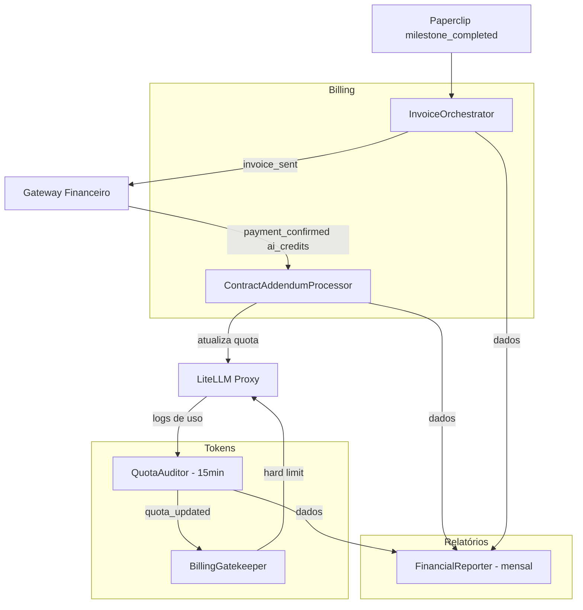

> **5 agentes · Quota de LLM, billing recorrente, cobranças de consultoria e relatórios executivos**

## Diagrama do Departamento

Diagrama do departamento financeiro



## QuotaAuditor (`quota_auditor`)

| Campo          | Valor                              |
| -------------- | ---------------------------------- |
| **Trigger**    | Cron a cada 15 minutos             |
| **Tools/MCPs** | `litellm_api_tool`, `directus_mcp` |

Coleta logs de uso de tokens de TODOS os workspaces (clientes + 5impl interna) e persiste métricas em `Token_Usage` no Directus. Calcula `percentage_used` por Virtual Key e dispara `quota_updated`.

**Fluxo:**

```
A cada 15 minutos:
  1. GET /litellm/usage (todos os Virtual Keys ativos)
  2. Para cada VKey: agrega tokens por modelo e por tag
  3. Calcula percentage_used = consumo / quota × 100
  4. Persiste em Token_Usage no Directus
  5. Dispara quota_updated → BillingGatekeeper
```

---

## BillingGatekeeper (`billing_gatekeeper`)

| Campo          | Valor                                                                             |
| -------------- | --------------------------------------------------------------------------------- |
| **Trigger**    | `quota_updated` (vindo do QuotaAuditor)                                           |
| **Tools/MCPs** | `directus_mcp`, `litellm_api_tool`, `zernio_tool`, `hermes_tool`, `telegram_tool` |

Aplica os gatekeepers configurados em `Gatekeepers` no Directus. Cada regra define `threshold` (%), `action` e `channel`:

| Action       | Comportamento                                        |
| ------------ | ---------------------------------------------------- |
| `notify`     | Alerta ao cliente: "Seus créditos atingiram X%"      |
| `soft_block` | Alerta crítico + Telegram ao Sócio                   |
| `hard_block` | Desabilita Virtual Key no LiteLLM + notifica cliente |

**Parâmetros:** Coleção `Gatekeepers` no Directus — configurável sem deploy.

---

## ContractAddendumProcessor (`contract_addendum_processor`)

| Campo          | Valor                                                                 |
| -------------- | --------------------------------------------------------------------- |
| **Trigger**    | Webhook `payment_confirmed` com `product_type = 'ai_credits'`         |
| **Tools/MCPs** | `litellm_api_tool`, `directus_mcp`, `gateway_api_tool`, `hermes_tool` |

Processa recarga de créditos de IA como 3 tarefas atômicas:

1. Incrementa quota da Virtual Key no LiteLLM
2. Insere `Contract_Addendum` no Directus
3. Recalcula assinatura no gateway (base + addendums)

Confirma recarga por email ao cliente via Hermes.

---

## InvoiceOrchestrator (`invoice_orchestrator`)

| Campo          | Valor                                                                                       |
| -------------- | ------------------------------------------------------------------------------------------- |
| **Trigger**    | Issue `milestone_completed` no Paperclip (fechada pelo Sócio)                               |
| **Tools/MCPs** | `directus_mcp`, `http_tool` (Puppeteer), `hermes_tool`, `gateway_api_tool`, `telegram_tool` |

Gera invoice de milestone de consultoria:

1. Busca `Consulting_Milestones` no Directus
2. POST no Puppeteer → renderiza PDF de invoice
3. Salva PDF e atualiza `milestone.status = 'invoiced'`
4. Envia email com invoice ao cliente via Hermes
5. Telegram ao Sócio: "Invoice #\{n\} enviada — R$ \{valor\}"
6. Após `payment_confirmed`: atualiza `status = 'paid'`

---

## FinancialReporter (`financial_reporter`)

| Campo          | Valor                                          |
| -------------- | ---------------------------------------------- |
| **Trigger**    | Cron dia 1 de cada mês às 07:00                |
| **Tools/MCPs** | `directus_mcp`, `telegram_tool`, `hermes_tool` |

Consolida relatório financeiro mensal com dados de `Token_Usage`, `Church_Subscriptions`, `Consulting_Milestones` e `Contract_Addendums`. Entrega:

| Métrica                             | Fonte                             |
| ----------------------------------- | --------------------------------- |
| MRR (Monthly Recurring Revenue)     | Church_Subscriptions + Consulting |
| Custo total de tokens por workspace | Token_Usage                       |
| Margem por cliente                  | MRR - token_cost_usd              |
| Invoices emitidas e recebidas       | Consulting_Milestones             |
| Créditos de IA vendidos             | Contract_Addendums                |

Envia relatório via Telegram ao Sócio e email ao time financeiro.
