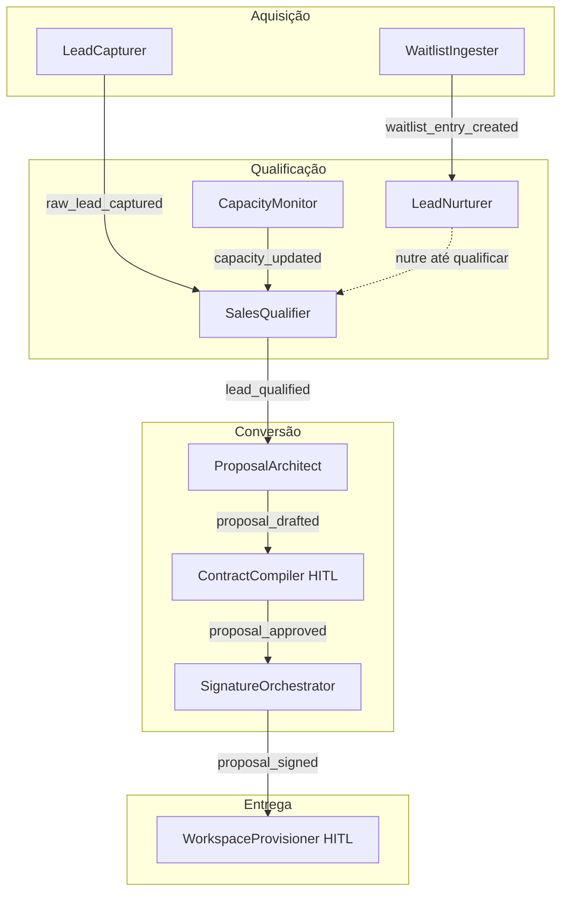

> **8 agentes do funil de vendas + 1 agente de provisionamento pós-contrato**

## Diagrama do Funil

---
Diagrama do funil comercial

## WaitlistIngester (`waitlist_ingester`)

| Campo          | Valor                                                |
| -------------- | ---------------------------------------------------- |
| **Trigger**    | Webhook HTTPS POST do formulário de waitlist do site |
| **Tools/MCPs** | `directus_mcp`, `hermes_tool`, `telegram_tool`       |

Processa entradas do formulário de lista de espera do site 5impl.is. Verifica duplicatas, cria registro em `Waitlist`, dispara email de confirmação via Hermes. Se `vertical = 'business'`, notifica Sócio via Telegram (lead B2B de alto valor) e adiciona ao `Lead_Nurture_Progress`.

---

## LeadNurturer (`lead_nurturer`)

| Campo          | Valor                                        |
| -------------- | -------------------------------------------- |
| **Trigger**    | Cron diário às 08:00 + `lead_status_changed` |
| **Tools/MCPs** | `directus_mcp`, `hermes_tool`, `zernio_tool` |

Executa sequências de nutrição de leads de forma dinâmica, baseado nas regras configuradas no Directus. Renderiza `body_template` com dados do lead e envia por email ou WhatsApp conforme `channel` configurado em `Lead_Nurture_Steps`.

**Parametrização:** Sequências e templates gerenciados 100% via Directus — zero mudança de código para alterar cadência ou conteúdo.

---

## LeadCapturer (`lead_capturer`)

| Campo          | Valor                                  |
| -------------- | -------------------------------------- |
| **Trigger**    | Webhook Zernio (`lead_captured` event) |
| **Tools/MCPs** | `directus_mcp`                         |

Normaliza e persiste leads capturados via formulários Zernio. Verifica duplicatas por email/telefone e dispara `raw_lead_captured`.

---

## CapacityMonitor (`capacity_monitor`)

| Campo          | Valor                                      |
| -------------- | ------------------------------------------ |
| **Trigger**    | `issue_status_changed` + Cron a cada 30min |
| **Tools/MCPs** | `directus_mcp`, `paperclip_issues_tool`    |

Conta projetos ativos no Paperclip e atualiza `Company_Settings.availability_flag`. Informa o `SalesQualifier` sobre capacidade disponível antes de qualificar novos leads.

**Parâmetro:** `Company_Settings.max_active_projects`

---

## SalesQualifier (`sales_qualifier`)

| Campo          | Valor                                  |
| -------------- | -------------------------------------- |
| **Trigger**    | `raw_lead_captured` / WhatsApp inbound |
| **Tools/MCPs** | `directus_mcp`, `zernio_tool`          |

Qualifica leads via conversa BANT no WhatsApp (Budget, Authority, Need, Timeline). Se agenda disponível e lead qualificado: envia link Calendly e dispara `lead_qualified`. Caso contrário: adiciona à fila de espera ou sequência `disqualified`.

---

## ProposalArchitect (`proposal_architect`)

| Campo          | Valor            |
| -------------- | ---------------- |
| **Trigger**    | `lead_qualified` |
| **Tools/MCPs** | `directus_mcp`   |

Lê `Services_Catalog` e `Services` no Directus, calcula preços com complexidade e descontos configurados, monta `Proposal` com `Proposal_Items` e `Consulting_Milestones`. Salva no Directus e dispara `proposal_drafted`.

---

## ContractCompiler (`contract_compiler`) 🔒 HITL

| Campo          | Valor                                                            |
| -------------- | ---------------------------------------------------------------- |
| **Trigger**    | `proposal_drafted`                                               |
| **Tools/MCPs** | `directus_mcp`, `http_tool` (Puppeteer), `paperclip_issues_tool` |

Mescla template HTML com variáveis da proposta, POST no Puppeteer → gera PDF do contrato. Cria issue HITL para o Sócio revisar. Após `proposal_approved`, dispara `proposal_approved` para o `SignatureOrchestrator`.

---

## SignatureOrchestrator (`signature_orchestrator`)

| Campo          | Valor                                               |
| -------------- | --------------------------------------------------- |
| **Trigger**    | `proposal_approved`                                 |
| **Tools/MCPs** | `clicksign_api_tool`, `hermes_tool`, `directus_mcp` |

Faz upload do PDF no Clicksign, configura partes e assinadores, obtém `signing_link`. Envia email ao lead com link de assinatura via Hermes. Após webhook `signature_completed`, atualiza `Proposals.status = signed` e dispara `proposal_signed`.

---

## WorkspaceProvisioner (`workspace_provisioner`) 🔒 HITL

| Campo          | Valor                                                                  |
| -------------- | ---------------------------------------------------------------------- |
| **Trigger**    | `proposal_signed`                                                      |
| **Tools/MCPs** | Paperclip Admin, LiteLLM API, n8n Admin, Directus Admin, `hermes_tool` |

Cria issue HITL com checklist de provisionamento (SMTP do cliente, quota de tokens, milestones do projeto). Após aprovação do Sócio, provisiona em paralelo: workspace Paperclip, Virtual Key LiteLLM, tenant n8n, instância Directus e profile Hermes.

Ver [Arquitetura Multi-Tenant](/architecture/multi-tenant/) para detalhes do fluxo.
