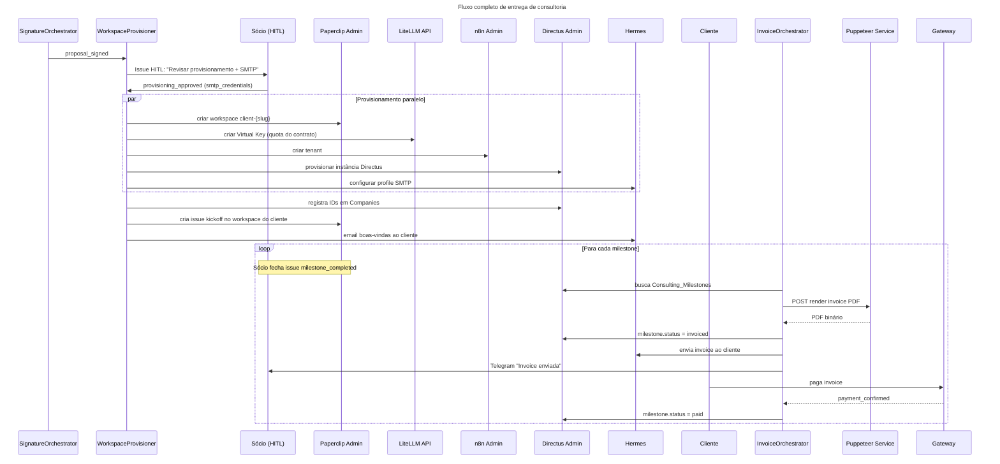

> **Pós-assinatura → Provisionamento → Kickoff → Milestones → Invoice → Encerramento**

## Diagrama de Sequência



## Checklist de Provisionamento

Após aprovação HITL, o `WorkspaceProvisioner` executa em paralelo:

| Item                | Sistema         | Resultado                                   |
| ------------------- | --------------- | ------------------------------------------- |
| Workspace Paperclip | Paperclip Admin | `workspace_id: client-{slug}`               |
| Virtual Key LLM     | LiteLLM API     | `vkey: vk-client-{slug}`, quota configurada |
| Tenant n8n          | n8n Admin       | Tenant isolado para workflows do cliente    |
| Instância Directus  | Directus Admin  | `directus_url: directus.{slug}.com`         |
| Profile SMTP        | Hermes          | Remetente `*@{dominio-cliente}.com`         |
| Registro no CRM     | Directus 5impl  | `Companies.workspace_ids` atualizado        |

## Estrutura de Milestones

```typescript
interface ConsultingMilestone {
  id: string;
  proposal_id: string;
  name: string; // "Kickoff + Discovery"
  description: string; // Entregáveis do milestone
  value: number; // Valor em R$
  due_date: date;
  status: "pending" | "in_progress" | "completed" | "invoiced" | "paid";
  completed_at?: datetime;
  invoiced_at?: datetime;
  paid_at?: datetime;
}
```

## Ciclo de Invoice por Milestone

```
Sócio fecha issue milestone_completed no Paperclip
  ↓
InvoiceOrchestrator detecta o evento
  ↓
Busca milestone + dados do cliente no Directus
  ↓
Gera PDF via Puppeteer Service
  ↓
Salva PDF + atualiza status = 'invoiced'
  ↓
Envia email ao cliente com PDF em anexo (Hermes)
  ↓
Telegram ao Sócio: "Invoice #{n} enviada — R$ {valor}"
  ↓
Cliente paga → Gateway webhook → status = 'paid'
```
