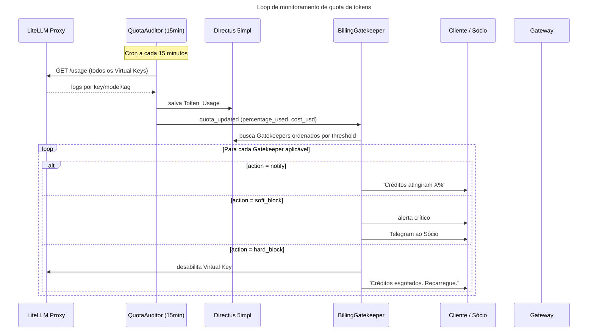
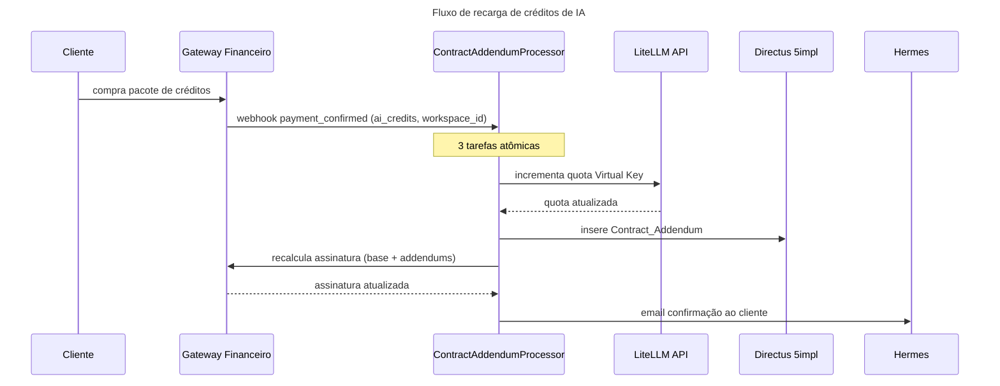

> **Quota Monitoring → Gatekeepers → Recargas → Relatório Financeiro**

## Loop de Quota (LiteLLM)



## Fluxo de Recarga de Créditos



## Configuração de Gatekeepers (Directus)

```typescript
interface Gatekeeper {
  id: string
  name: string
  threshold: number        // % de uso (ex: 80)
  action: 'notify' | 'soft_block' | 'hard_block'
  channel: 'email' | 'whatsapp' | 'both'
  template_key: string     // ex: "quota_warning_80"
  applies_to: 'all' | 'client' | 'church' | 'internal'
  active: boolean
}
```

### Configuração Padrão

| threshold | action | channel | Destinatário |
|---|---|---|---|
| 70% | `notify` | `email` | Cliente |
| 85% | `notify` | `whatsapp` | Cliente + Sócio (Telegram) |
| 95% | `soft_block` | `both` | Cliente + Sócio urgente |
| 100% | `hard_block` | `both` | Desabilita + notifica |

## Schema Token_Usage (Directus)

```typescript
interface TokenUsage {
  id: string
  workspace_id: string      // Virtual Key slug
  virtual_key_id: string    // LiteLLM VKey ID
  model: string             // ex: "claude-3-5-sonnet"
  agent_tag: string         // ex: "editorial.content_writer"
  tokens_input: number
  tokens_output: number
  cost_usd: number
  recorded_at: datetime
}
```

## Relatório Financeiro Mensal

O `FinancialReporter` consolida no dia 1 de cada mês:

| Métrica | Fórmula |
|---|---|
| **MRR** | Σ Church_Subscriptions.monthly_value + Σ Consulting recorrente |
| **Custo de tokens** | Σ Token_Usage.cost_usd (mês) |
| **Margem bruta** | MRR − custo_tokens − overhead |
| **Custo por agente** | Σ cost_usd GROUP BY agent_tag |
| **ROI por cliente** | MRR_cliente / custo_tokens_cliente |
