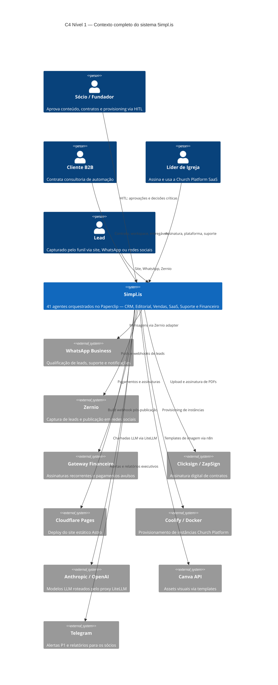

import { CardGrid, Card } from "@astrojs/starlight/components";

## Diagrama de Contexto (C4 — Nível 1)

## Índice de Seções

<CardGrid>
  <Card title="Arquitetura" icon="setting">
    C4 Context, Containers, Multi-Tenant. Visão macro e componentes técnicos
    internos.
  </Card>
  <Card title="Agentes" icon="puzzle">
    41 agentes em 7 departamentos: Executivo, Editorial, Vendas, SaaS Church,
    Suporte e Financeiro.
  </Card>
  <Card title="Schemas" icon="document">
    Todas as coleções Directus com campos, tipos, relações e script de
    bootstrap.
  </Card>
  <Card title="Fluxos" icon="right-arrow">
    Diagramas de sequência dos 5 fluxos operacionais principais.
  </Card>
  <Card title="Integrações & Provisioning" icon="external">
    Spec das APIs externas e setup completo de workspace de cliente.
  </Card>
  <Card title="Onboarding & Parametrização" icon="list-format">
    Sequências de onboarding e como agentes lêem configs dinâmicas do Directus.
  </Card>
</CardGrid>

## Princípios Arquiteturais:badge[New]

| Princípio             | Definição                                                                                                                 |
| --------------------- | ------------------------------------------------------------------------------------------------------------------------- |
| **SoC**               | Cada agente tem exatamente uma responsabilidade                                                                           |
| **Agente vs n8n**     | Agentes para integrações que exigem inteligência contextual; n8n para fluxos com loops, branches complexos, retry em lote |
| **Times de Agentes**  | Se um agente faz demais, componentiza em equipe especializada                                                             |
| **Multi-tenant**      | Cada cliente tem workspace isolado: Paperclip + n8n + Directus + LiteLLM VKey + Hermes profile                            |
| **HITL Seletivo**     | Autonomia total para operações de baixo risco; bloqueio humano para publicações, contratos e provisioning                 |
| **GitOps**            | Documentação, schemas e specs versionados em Git                                                                          |
| **DRY entre Agentes** | Payloads JSON curtos transferidos entre agentes; nunca repetir busca de dados já obtidos                                  |
