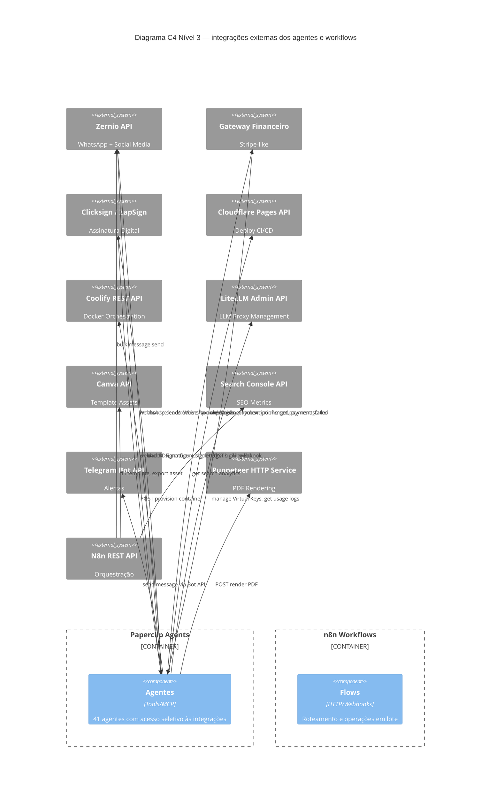

# Integrações Externas

> Spec de todas as APIs externas, padrões de autenticação e contratos de webhook

---

## Diagrama de Integrações (C4 — Nível 3)

---

## Especificação por Integração

### Zernio
- **Uso:** Captura de leads (formulários), envio/recebimento de WhatsApp, publicação em redes sociais
- **Auth:** API Key em header `Authorization: Bearer {ZERNIO_API_KEY}`
- **Webhooks inbound:** `lead_captured`, `message_received`
- **Agentes:** `LeadCapturer`, `SalesQualifier`, `OnCallSupport`, `SocialMediaPublisher`, `NewsletterDispatcher`, `OnboardingOrchestrator`
- **Secret:** `ZERNIO_API_KEY` — armazenado como Paperclip workspace secret

### Gateway Financeiro (Stripe-like)
- **Uso:** Assinaturas recorrentes Church SaaS, cobranças de addendums e créditos
- **Auth:** API Key em header + webhook signature validation (HMAC)
- **Webhooks inbound:**
  - `payment_confirmed` → `SubscriptionProvisioner` (church_base), `ModuleActivator` (addon), `ContractAddendumProcessor` (ai_credits)
  - `payment_failed` → `DunningManager`
- **Agentes:** `SubscriptionProvisioner`, `ModuleActivator`, `DunningManager`, `ContractAddendumProcessor`, `RenewalManager`
- **Secret:** `GATEWAY_API_KEY`, `GATEWAY_WEBHOOK_SECRET`

### Clicksign / ZapSign
- **Uso:** Upload de PDF de contrato, configuração de signatários, obtenção de link de assinatura
- **Auth:** `Authorization: Token {CLICKSIGN_TOKEN}`
- **Fluxo:**
  1. `POST /api/v1/documents` — upload do PDF
  2. `POST /api/v1/documents/{key}/signers` — adiciona signatários
  3. `POST /api/v1/documents/{key}/notifications` — envia convite
  4. Webhook `POST /webhooks/signature` → `proposal_signed`
- **Agente:** `SignatureOrchestrator`
- **Secret:** `CLICKSIGN_ACCESS_TOKEN`

### Cloudflare Pages
- **Uso:** Deploy automático do site Astro após publicação de post
- **Auth:** Build webhook URL (segredo embutido na URL)
- **Fluxo:** `POST {CLOUDFLARE_BUILD_WEBHOOK_URL}` sem body
- **Agente:** `StaticSitePublisher`
- **Config:** `Company_Settings.cloudflare_build_webhook`

### Coolify / Docker
- **Uso:** Provisionar e gerenciar instâncias Docker da Church Platform
- **Auth:** `Authorization: Bearer {COOLIFY_API_TOKEN}`
- **Endpoints relevantes:**
  - `POST /api/v1/deploy` — nova instância
  - `GET /api/v1/services/{id}/status` — verificar health
  - `DELETE /api/v1/services/{id}` — offboarding
- **Agente:** `SubscriptionProvisioner`, `WorkspaceProvisioner`
- **Secret:** `COOLIFY_API_TOKEN`, `COOLIFY_API_URL`

### LiteLLM Admin API
- **Uso:** Criar/atualizar/desabilitar Virtual Keys; buscar logs de uso
- **Auth:** `Authorization: Bearer {LITELLM_MASTER_KEY}`
- **Endpoints relevantes:**
  - `POST /key/generate` — cria Virtual Key com budget
  - `POST /key/update` — atualiza quota
  - `POST /key/delete` — desabilita key
  - `GET /global/spend/logs` — logs de uso
- **Agentes:** `WorkspaceProvisioner`, `QuotaAuditor`, `BillingGatekeeper`, `ContractAddendumProcessor`
- **Secret:** `LITELLM_MASTER_KEY`, `LITELLM_API_URL`

### Canva API
- **Uso:** Gerar assets visuais a partir de templates brandados
- **Auth:** OAuth 2.0 com `CANVA_CLIENT_ID` + `CANVA_CLIENT_SECRET`
- **Fluxo (via n8n):**
  1. n8n recebe trigger do `ImageDirector`
  2. n8n autentica via OAuth
  3. `POST /v1/designs` — cria design a partir de template
  4. `POST /v1/exports` — exporta como PNG/JPG
  5. n8n retorna URL do asset ao `ImageDirector`
- **Integração:** Via n8n (não diretamente pelos agentes — fluxo complexo)

### Google Search Console API
- **Uso:** Coletar métricas de SEO (impressões, cliques, posição) por post
- **Auth:** Service Account JSON (Google OAuth2)
- **Endpoint:** `POST /webmasters/v3/sites/{siteUrl}/searchAnalytics/query`
- **Integração:** Via n8n (coleta semanal, salva no Directus) ou diretamente pelo `ContentAnalyst` via `http_tool`

### Telegram Bot API
- **Uso:** Alertas P1, relatórios executivos mensais para os sócios
- **Auth:** `https://api.telegram.org/bot{BOT_TOKEN}/sendMessage`
- **Payload:** `{ chat_id, text, parse_mode: "Markdown" }`
- **Agentes:** `CEO`, `IncidentDispatcher`, `GovernanceAuditor`, `ChurnSignalDetector`, `FinancialReporter`, `InvoiceOrchestrator`
- **Secret:** `TELEGRAM_BOT_TOKEN`, `TELEGRAM_CHAT_ID` (em Company_Settings)

### Puppeteer HTTP Service
- **Uso:** Renderizar HTML para PDF (contratos e invoices de consultoria)
- **Auth:** API Key interna em header `X-Internal-Key: {PUPPETEER_SERVICE_KEY}`
- **Endpoint:** `POST /render/pdf`
- **Payload:** `{ html: string, filename: string, options: { format: 'A4' } }`
- **Response:** `{ pdf_url: string }` (arquivo salvo localmente)
- **Agentes:** `ContractCompiler`, `InvoiceOrchestrator`

---

## Gestão de Secrets

Todos os secrets são armazenados como **Paperclip workspace secrets** — nunca em código ou no Directus. O acesso é feito pelos agentes via o mecanismo de secrets do workspace correspondente.

| Secret | Workspace | Agente(s) |
|---|---|---|
| `ZERNIO_API_KEY` | 5impl | LeadCapturer, SalesQualifier, SocialMediaPublisher |
| `GATEWAY_API_KEY` | 5impl | SubscriptionProvisioner, DunningManager, ContractAddendumProcessor |
| `GATEWAY_WEBHOOK_SECRET` | 5impl | Todos que recebem webhooks do gateway |
| `CLICKSIGN_ACCESS_TOKEN` | 5impl | SignatureOrchestrator |
| `CLOUDFLARE_BUILD_WEBHOOK` | 5impl | StaticSitePublisher |
| `COOLIFY_API_TOKEN` | 5impl | SubscriptionProvisioner, WorkspaceProvisioner |
| `LITELLM_MASTER_KEY` | 5impl | QuotaAuditor, BillingGatekeeper, WorkspaceProvisioner |
| `TELEGRAM_BOT_TOKEN` | 5impl | CEO, IncidentDispatcher, FinancialReporter |
| `PUPPETEER_SERVICE_KEY` | 5impl | ContractCompiler, InvoiceOrchestrator |
| `CLIENT_SMTP_*` | client-\{slug\} | Hermes profile do cliente |
