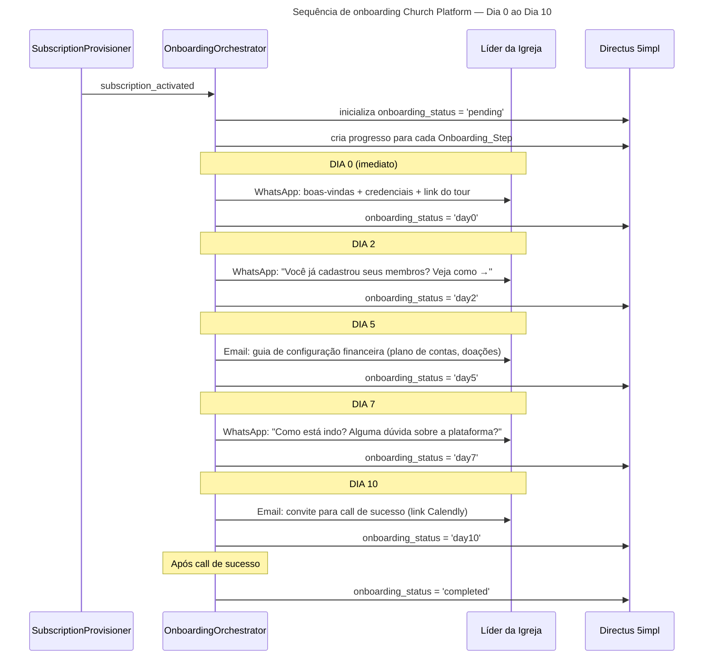

# Onboarding — Church Platform SaaS

> Sequência pós-ativação de assinatura: Dia 0 ao Dia 10

---

## Fluxo Detalhado



---

## Templates por Step

Configurados em `Onboarding_Steps` no Directus — editáveis sem código.

### Dia 0 — WhatsApp (imediato)

```
Olá, {leader_name}! 👋

Bem-vindo(a) à Church Platform! Sua plataforma já está ativa.

🔗 Acesse aqui: {platform_url}
👤 Email: {leader_email}
🔑 Senha provisória: {temp_password}

Por onde começar:
1. Faça login e troque sua senha
2. Configure as informações da sua igreja
3. Cadastre os primeiros membros

Dúvidas? Estamos aqui! Responda esta mensagem a qualquer hora.
```

### Dia 2 — WhatsApp

```
Oi, {leader_name}! Como está indo?

Uma dica rápida: a parte mais importante para começar é cadastrar seus membros.

📋 Tutorial rápido → {tutorial_members_url}

Qualquer dúvida, é só chamar! 🙌
```

### Dia 5 — Email

**Subject:** Configurando o financeiro da \{church_name\}

```
Olá, {leader_name}!

Agora que você já conhece a plataforma, é hora de configurar o módulo financeiro.

O que você pode fazer:
✅ Configurar plano de contas
✅ Registrar categorias de doações
✅ Configurar campanhas financeiras

Guia completo: {tutorial_financial_url}

Qualquer dúvida, responda este email.
```

### Dia 7 — WhatsApp

```
Oi, {leader_name}! Já faz uma semana desde que você ativou a Church Platform.

Como está sendo a experiência? Tem alguma dúvida que posso ajudar?

Responda aqui e te ajudamos em minutos! 💬
```

### Dia 10 — Email

**Subject:** Vamos fazer uma call rápida? ☕

```
Olá, {leader_name}!

Você completou a primeira semana na Church Platform! 🎉

Queremos entender como foi sua experiência e garantir que você está aproveitando tudo que a plataforma oferece.

Que tal uma call de 20 minutos?

📅 Agende aqui: {calendly_url}

Se preferir, pode responder este email com suas dúvidas.
```

---

## Configuração dos Steps no Directus

```json
[
  {
    "step_order": 1,
    "day_offset": 0,
    "channel": "whatsapp",
    "template_key": "onboarding_day0_whatsapp",
    "description": "Boas-vindas com credenciais de acesso"
  },
  {
    "step_order": 2,
    "day_offset": 2,
    "channel": "whatsapp",
    "template_key": "onboarding_day2_members",
    "description": "Incentivo a cadastrar membros"
  },
  {
    "step_order": 3,
    "day_offset": 5,
    "channel": "email",
    "subject": "Configurando o financeiro da {church_name}",
    "template_key": "onboarding_day5_financial",
    "description": "Guia de configuração financeira"
  },
  {
    "step_order": 4,
    "day_offset": 7,
    "channel": "whatsapp",
    "template_key": "onboarding_day7_checkin",
    "description": "Check-in de experiência"
  },
  {
    "step_order": 5,
    "day_offset": 10,
    "channel": "email",
    "subject": "Vamos fazer uma call rápida? ☕",
    "template_key": "onboarding_day10_success_call",
    "description": "Convite para call de sucesso"
  }
]
```

---

## Variáveis Disponíveis nos Templates

| Variável                   | Fonte                                                 |
| -------------------------- | ----------------------------------------------------- |
| `{leader_name}`            | `Church_Clients.leader_name`                          |
| `{church_name}`            | `Church_Clients.church_name`                          |
| `{leader_email}`           | `Church_Clients.leader_email`                         |
| `{platform_url}`           | `Church_Clients.directus_instance_url`                |
| `{temp_password}`          | Gerado no provisionamento, armazenado temporariamente |
| `{tutorial_members_url}`   | `Company_Settings.tutorial_members_url`               |
| `{tutorial_financial_url}` | `Company_Settings.tutorial_financial_url`             |
| `{calendly_url}`           | `Company_Settings.success_call_calendly_url`          |
